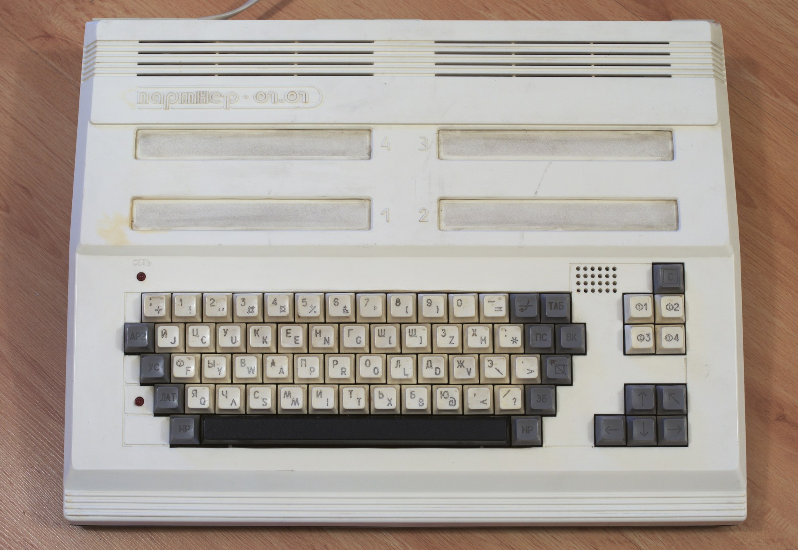

# IT's my life

В одом из автобиографических текстов я уже писал, что 5 и 6 классы
закончил не в обычной, а в математической школе №33 Ярославля.
Склонности к математике у меня были, но не могу сказать, что она меня
сильно увлекала. Я не был первым учеником на уроках собственно
математики, но в этой школе было еще много увлекательного. Меня,
например, заинтересовали занятия в “Заочной школе программирования” при
Новосибирском отделении АН СССР. В журнале “Квант” публиковались
задания, связанные с тем, что теперь называется информатикой. Их нужно
было письменно решить и отправлять почтой в Новосибирск. Оттуда
тетрадки приходили проверенными (с написанными красной ручкой на полях
замечаниями, исправлениями и оценками). От отправки до получения
проходило около недели. Выполнять эти задания было скучновато, но в тот
момент я почувствовал, что компьютеры, о которых все говорят о чем-то
футуристическом и фантастическом, на самом деле уже где-то здесь,
рядом. Да, к ним не всех допускают, но ведь допускают же кого-то!
“Может, и мне когда-нибудь удастся приобщиться?”, - думалось тогда.

Компьютеры привлекали меня, прежде всего, своей предсказуемостью. В
отличие от людей, они работают независимо от эмоций. Сложные вычисления
меня мало привлекали. Более интересны были перспективы построения
справочных систем, помогающих ориентироваться в текстовой информации. О
сетях и тем более Интернете тогда в СССР не было и речи, шел 1977 год,
но идеи витали в воздухе.

Спустив на тормозах решение скучных алгоритмов на языке “Робик”, я стал
усиленно штудировать книги из серии “Эврика”, посвященные компьютерам.
Представления об их современной архитектуре к тому времени уже вполне
сформировались и стали достоянием научно-популярной литературы. В 13
лет я уже четко представлял себе что такое булева алгебра, как работает
оперативная память (на ферритовых кольцах), процессор (на электронных
лампах), механизмы долгосрочного храниения информации (перфокарты и
перфоленты). Не имея возможности ознакомиться с настоящими компьютерами
(их тогда в городе можно было по пальцам одной руки пересчитать), я
активно интересовался всем, что с ними связано. И не без результата. По
крайней мере, оказавшись в начале 80-х со школьным другом на ВДНХ в
павильоне, посвященном отечественной вычислительной технике, я
уверенно, не читая подписей к экспонатам объяснял: “Это кремний, его в
виде цилиндра вытягивают из сверхчистого расплава. Потом
разрезают на тонкие круглые пластины и методом печатного монтажа
наносят полупроводниковые элементы, резисторы и прочие микродетали”.

У меня не было возможности заниматься практической радиоэлектроникой,
но я жадно вчитывался в схемы журналов “Радио”, “Юный техник” и
“Моделист-конструктор”, в надежде собрать из подаренного дядей
электронного хлама хоть что-то похожее на вычислительное устройство.
Помню, у кого-то в гостях не удержался, и без спроса стал играть
хозяйским микрокалькулятором “Электроника-БК”, за что получил нагоняй
от мамы. Не в последнюю очередь увлечение компьютерами привело меня к
мысли о том, что после 8 класса нужно идти в техникум, на отделение
“Автоматика и телемеханика”. Из 33-й школы к тому времени пришлось уйти
по семейным обстоятельствам, о них написано в другом материале.

Я еще не знал, что автоматика слабо связана с вычислительной техникой
(по крайней мере, так было тогда), но желание поскорее добраться до
умной электроники взяло свое. Несмотря на аттестат без троек, после 8
класса я, все-таки, поступил в техникум. Правда, не Железнодорожный,
как планировал, а Автомеханический на отделение “Металлообрабатывающие
станки и автоматические линии”. Доволен был абсолютно и ни капли не
горевал по поводу того, что не направился по престижному пути “9-10
классы -> вуз”.

В техникуме, однако, предметов, связанных вычислительной техникой,
практически не было. Лишь на последнем курсе нам прочитали полугодовой
курс о станках с ЧПУ, да и то специалист с завода, который его вел,
являлся на лекции не особо регулярно, так что вся надежда была вновь на
самообразование. Уже тогда я умел пользоваться читальным залом
областной библиотеки, где однажды подготовил доклад о современных (на
тот момент) промышленных автоматических линиях, в которых применялись
уже не привычные в ту пору аналоговые технологии, а полноценные
цифровые. Доводилось во время заводских практик и экскурсий видеть и
станки с ЧПУ, и общаться с их наладчиками, но в советское время такие
производственные участки были особо охраняемыми, допуск туда был
затруднен.

В те годы появились и первые персональные компьютеры. Об импортных
приходилось только мечтать, а вот собранные по схемам из жрналов
“Радио” кое у кого из знакомых уже были. Но практическая
радиоэлектроника по прежнему была моим слабым местом. Я даже не смог
починить одолженные у знакомых для проведения дискотеки бегуие огни на
микросхемах. Они перегорели в разгар танцевального веселья (я пробовал
силы еще и в качестве диджея), и у меня были в связи с этим
определенные неприятности.

В 1986 г. меня призвали в армию, где, как ни странно, нашлось несколько
уникальных возможностей для того, чтобы больше узнать о вычислительной
технике. Во-первых, попал я в войска связи, где электроники было
довольно много. Правда, работала она на сильно устаревшей элементной
базе (ламповые радиостанции чуть ли не 50-х годов), но было и кое-то
поновее. Во-вторых, можно было раздобыть книги с грифом для служебного
пользования, где сведения о компьютерах излагались в объемах гораздо
больших, чем
в научно-популярной литературе. Одну такую брошюру помню особенно
хорошо. Она называлась примерно так: “Мегабайты и мегаканалы”, а
описывались в ней технологии, о которых гражданскому населению стало
известно лишь лет 10 спустя: WiFi, спутниковые и сотовые способы
передачи цифровой информации, оптоволокно. Да, да, в 1987 году всё это
армейским связистам было уже известно.

Еще один удивительный случай, приблизивший меня к компьютерной
практике, произошел как-то раз на боевом дежурстве. Один парень из
Армении, попавший в армию из-за того, что не сдал сессию в вузе,
обучался до службы на факультете прикладной математики. Поведав ему о
своем интересе к компьютерам, я получил в подарок учебник по
“Фортрану”, который с удовольствием стал штудировать. Практические
задания выполнять было не на чем, и я просто стал записывать учебные
программы в тетрадь, как когда-то на занятиях “Заочной школы
программирования”. И это не была блажь на один-два дня. Я занимался по
этому учебнику несколько недель, пока не убедился, что могу писать
довольно длинные и сложные программы.

Вернувшись из армии, я устроился наладчиком на Ярославский моторный
завод, один из крупнейших в стране (в лучшие времена там работало о 40
тыс. человек). Наша мастерская принадлежала технологической части цеха,
и задачей которой было внедрение и отладка производственных технологий.
Если приходило новое оборудование, его до ума доводили именно мы,
секция наладки. О технологическом отставании советского машиностроения
всем, интересущимся историей СССР, хорошо известно. Даже новые станки
были построены по принципам 10-20-летней давности. Но в самом конце
1980-х в нашем цеху вдруг появилась большая партия шлифовальных станков
с программоконтроллерами. Ими уже можно было не просто полюбоваться, а
поработать с ними вплотную.

К электронике меня по-прежнему не допускали. Налаживать ее приходили
специалисты из общезаводской службы. Однако я так активно интересовался
всем, что они делали, что в конце-концов начальству пришлось
договориться о том, чтобы мене дали копию руководства по
программированию этих микроконтроллеров, и я даже изменил программу,
сделав более тщательной правку шлифовального круга алмазным карандашом.
Более того, ее внедрили, перепрошив микросхему с помощью специального
чемоданчика, оснащенного ультрафиолетовой лампой.

Программоконтроллеры, о которых идет речь, изготавливали в Киеве.
Работали они не очень стабильно, не были устойчивы к повышенной
температуре цеха и к агрессивной воздушной среде, царившей в цеху
(угунная пыль, пары СОЖ, масляная взвесь). Через некоторое время их
стали потихоньку менять на аппаратуру более солидной фирмы Siemens.

В связи с проникновением в наши машиностроительные цеха оборудования из
Западной Европы произошла еще одна подвижка в моем изучении
компьютерных технологий. На завод приехали представители компании
Allen-Bradley, производящей автоматические линии. Они решили провести
семинар для заводских специалистов. Узнав об этом, я упросил начальника
техчасти направить туда и меня. Он согласился нехотя, считая, что
наладчику металлорежущих станков не престало с электроникой
валандаться. Тем не менее, на семинар я попал. Он был посвящен
компьютерным сетям. Так я впервые узнал о технологии Ethernet, витой
паре,
маршрутизаторах и тому подобных вещах. Самое же неожиданное произошло в
конце. Я решил задать вопрос ведущему семинар, немцу по фамилии
Хендрик. Он выступал с помощью переводчика. Получив ответ на свой
вопрос я вдруг понял, что могу задать еще один. уточняющий, причем
lдаже сообразил, как это сказать по-немецки (изучал в школе). Услышав
вопрос на родном языке, мистер Хендрикс (мистер потому, что фирма,
все-таки, английская) оживился. По окончании мероприятия, когда
раздавали рекламные материалы, мы еще раз обменялись с ним парой фраз,
и он дал мне свою визитку, настоятельно добавив: “Schreibe Mich!
Schreibe Mich!”. Это был реальный шанс уехать в Европу, но я им не
воспользовался, слишком уж всё это было неожиданно. А вот визитка
надолго стала предметом семейной гордости.

В самом начале 1990-х при заводе проводились недельные компьютерные
курсы, и я опять выпросил у начальника право посещать их. Занимались на
ГДР-овских Robotron’ах. Изучали электронные таблицы. Кроме того, я
обзавелся знакомыми в заводском вычислительном центре, где уже
появились первые макинтоши. Правда, сбегать туда я мог лишь в обеденный
перерыв, но какие-то азы смог узнать и там.

Компьютеров на заводе становилось всё больше. В 1993 году я начал
писать диплом (учился на вечернем, это [7]другая история). Я решил
самостоятельно набрать его на компьютере в одной из техчастей. Из
текстовых редакторов там оказался только тот, что встроен в Norton
Commander (вызывается по F4). Кроме того, в результате неправильной
русификации на клавиатуре не работала буква “р”. Как хозяева компьютера
решают эту проблему я спросить постеснялся, поэтому заблаговременно
набирал длинную цепочку латинских ppppppppppppppppppppppppppppppppp и
“отстегивал” по одной по мере надобности. Диплом я набрал, по всем
правилам отформатировал, распечатал, даже переплел в заводской
переплетной мастерской и, благодаря этому, хорошо съэкономил на услугах
машинистки.

Между тем, персональные компьютеры начали появляться не только на
предприятиях, но и в семьях. Если на рубеже 80-х и 90-х я думал, что
буду копить на свой первый компьютер много лет, как на автомобиль, то
уже через пару лет в комиссионных магазинах стали появляться бытовые
вычислительные устройства, которые хоть и стоили несколько месяцных
зарплат, но уже не выглядели абсолютно недосягаемыми. В большинстве
своем это были экзотические отечественные аппараты, малосовместимые с
западной техникой.

В 1993-м, кажется, году мы с супругой решили купить один из таких
компьютеров. Жена работала в школе и пожертвовала на то благое дело
летние (у учителей - за 3 месяца) отпускные. Компьютер был
отечественного производства, назывался “Партнер” и представлял собой
общирную клавиатуру, внутри которой и находилась вся электроника. В
качестве монитора использовался телефизор (в нашем случае - советский
черно-белый ламповый), подключаемый через антенный вход. В качестве
накопителя - магнитофон (в моем случае даже не кассетный, а
[8]катушечный), подключаемый через линейный аудиовыход.

Я проводил за “Партнером” всё свободное время, осваивая его ассемблер
по прилагаемой книжке. Написав несколько программ (например,
интерактивных опросников) и набрав несколько текстов, я понял, что
наличие компьютера - это половина дела. Главное - совместимость, чтобы
можно было обмениваться информацией с другими. Мой же “Партнер” был
вещью в себе. К нему нельзя было подключить принтер (то есть, наверное,
можно, но совсем не очевидным способом), программы и файлы от него не
подходили к другим компьютерам. В отчаянии я пытался даже
фотографировать экран постранично и делать что-то вроде диафильмов, но
это уж было, как сейчас говорят, совсем “не продакшн”.

Следующий компьютер я выбирал с учетом требований совместимости. Прежде
всего, у него должен был быть дисковод, так как магнитная лента в
качестве носителя представляла собой ненадежный вариант. Она то и дело
обсыпалась или размагничивалась. То ли дело 5-дюймовая кассета. Она и
работает быстрее, и компьютеров, воспринимающих такие носители, уже в
городе достаточно. В конце концов по объявлению с рук мы купили
подержанный Sinclair, и жизнь заиграла новыми красками. Дело деже не в
резко расширившемся диапазоне доступных компьютерных игр. Ими я во все
времена интересовался мало, а когда от сверхусердия сломалась ручка
джойстика, интенсивно использовавшаяся в какой-то стрелялке, и вовсе
перестал тратить на них время. Sinclair давал массу возможностей для
того бизнеса, которым я занимался в то время: написание курсовых и
дипломов на заказ.

Программное обеспечение представляло собой операционную систему Iskra
DOS (фирма Iskra, кажется, до сих пор работает в Питере, производит
электронику). ОС загружалась с 5-дюймовой дискеты. К ней прилагался
полноценный офисный пакет: текстоый редактор с макросами, базы данных и
электронные таблицы. Не хватало только принтера, чтобы распечатывать
готовые заказы, но за этой услугой я обращался к знакомым из
вычислительного центра всё того же моторного завода. Сам я из
машиностроения в 1994 году ушел,
и написание курсовых и дипломов стало в середине 90-х одним из моих
основных заработков. Тексты, изготовленные с помощью нового компьютера,
получались вполне опрятными, даже со сносками и кое-каким
форматированием, так что заказчики были довольны.

Тем временем в жизнь мало-помалу стал проникать Интернет (упорно пишу
это слово с заглавной буквы, потому что он у нас один, как Солнце).
Ярославль стал одним из пилотных городов, где Фонд Сороса подключил
университет к глобальной сети. Я как раз заканчивал учебу и в 1994 году
еще успел по студенческому билету походить в компьютерный зал ЯрГУ. В
первые недели народ или еще не понял, что это такое, или боялся, или не
верил в то, что появилась такая бесплатная фантастическая возможность.
Так или иначе, а поначалу в этм зале было довольно безлюдно. Там стояло
несколько десятков вполне приличных по тем временам макинтошей, и
скорость соединения была достаточно комфортной. Но это быстро
кончилось. Студенты поняли, что такое Интернет, и в заветное помещение
стало не пробиться. Скорость упала почти до нуля, так что ходить туда
стало не интересно.

Не дремал и монополист телефонной связи Яртелеком. Он примерно в то же
время (1994-1995 гг.) стал предоставлять услуги доступа в Интернет на
коммерческой основе. Я понял, что не видать мне этого блага (очень в ту
пору дорогостоящего, но уж очень желанного) со своим Sinclair’ом. Стал
думать, как обзавестись IBM-совместимым компьютером.

Уволившись с завода (там в ту пору стало уж совсем плохо с
заработками), я обнаружил, что, благодаря только что законченному
университету, могу работать в редакциях газет. Это способствовало
раскрытию моих как гуманитарных, так и технических способностей,
поскольку в газетах для верстви уже вовсю использовались компьютеры. По
крайней мере было с кем посоветоваться. Я решил собрать IBM-совместимый
компьютер в минимальной конфигурации. В смету заложил всё самое дешевое
и минимальное. Отказался от жесткого диска, оставив лишь дисковод.

В ту пору на сборке еще можно было съэкономить (через некоторое время
готовый компьютер стал стоить дешевле своих комплектующих). Накопив и
заняв денег, я купил материнскую плату, 386-й процессор, видеокарту,
планку памяти, дисковод, корпус, клавиатуру и черно-белый монитор. Было
это еще до августа 1995 года, когда появилась Windows-95, так что
жесткий диск не очень-то был и нужен, так как работать я решил в среде
MS-DOS. Свинтить вместе комплектующие было несложно, но получившийся
компьютер не заработал. Внутри всё похолодело, но делать было нечего,
нужно было ехать в мастерскую в ожидании затрат теперь еще и на сборку.
Кончилось всё хорошо. Оказалось, что я не подложил под материнскую
плату токоизолирующую шайбу, и она коротнула на корпус, так что в
мастерской с меня даже денег не взяли.

IBM-совместимый компьютер еще более расширил мои возможности. Редакторы
“Лексикон” и Word-5 позволяли быстро набирать тексты и статьи для
газет. Была даже программа для проверки орфографии “Буквоед”, так что
качество моей продукции еще больше повысилось. Но по-прежнему манил
Интернет. Ведь ради него я сделал такой нешуточный апгрейд. Едва
рассчитавшись с долгами, я стал искать в магазине подходящий модем. Их
пока в продаже было немного, потому что домашний интернет мало кому был
по карману, да и не распробовал еще рынок в тот момент новую
возможность. Денег на дорогую скоростную модель на было, и я купил
красивый внешний модем в алюминиевом корпусе. Недостаток у него был
только один: низкая скорость (2400 бит/с). Теперь нужно было заключить
договор с Яртелекомом. Деньги на это нешуточное по тем временам дело
опять пришлось занимать. Тем не менее, в один прекрасный день я был
готов выйти на связь.

Графической среды типа Windows я себе пока позволить не мог, так что
браузер запустить было не в чем. Однако в ту пору этого и не
требовалось. Яртелеком предоставлял telnet-доступ к своему серверу, где
для каждого клиента выделялось стандартное пользовательское
unix-пространство. Консольными инструментами (например, браузером lynx)
можно было запрашивать из Интернета нужные материалы по скоростному
каналу, а потом потихоньку выкачивать их на домашний компьютер с
помощью модема через “последнюю милю”.

Интернет тогда был процентов на 90 англоязычным, каталог всех его
сайтов помещался в 300-страничной книжке, но всё-равно было интересно.
Речь не шла не только о форумах и прочей интерактивности, но даже об
изображениях. И всё же ощущение того, что за доли секунды можешь
получить доступ к заокеанским книгам и статьям, которые ще несколько
лет назад находились за “железным занавесом”, было волшебным. Не скажу,
что я свободно владел английским и прочитывал всё, что мог скачать во
время этих сеансов, но по крайней мере ориентироваться в Интернете я
уже тогда, когда еще не было привычных теперь поисковых машин, научился
неплохо. Тогда были эхоконференции и прочие формы, ныне отмершие, так
что и на русском языке было что почитать.

Деньги на яртелекомовском счете быстро кончились, и я решил уговорить
директора газеты “Ярославская неделя”, где тогда работал, подключить
редакцию к Интернету. Это давало бы не только возможность получать
быстро свежие новости (русскоязычные сайты появлялись как грибы после
дождя), но и оперативно присылать материалы в редакцию, что для меня,
например, как жителя городской окраины, было актуально. Руководитель
согласился, но вскоре счел, что дело это затратное, что мы, молодежь,
слишком
много стали проводить времени в киберпространстве, вместо того, чтобы
работать (это было правдой). В общем, вскоре приобщение к Интернету за
счет фирмы тоже закончилось. Я, впрочем, свой сетевой голод более-менее
удовлетворил, и отнесся к этому спокойно.

Места работы в те бурные годы я менял довольно часто, но при переходе
из редакции в редакцию наличие предоставляемого служебного интернета
интересовало меня едва ли не больше, чем размер зарплаты. К 1998 году,
впрочем, это благо перестало быть роскошью. Интернет потихоньку
превращался в обычную коммунальную услугу. По крайней мере, к 1998 году
устойчивый домашний доступ к глобальной сети у меня уже был. За эти три
года, прошедшие с момента приобретения первого IBM-совместимого
компьютера, цифровых чудес в моем распоряжении стало гораздо больше.
Давно был куплен жесткий диск и установлена ОС Windows, в сеть выводил
модем со скоростью 19600 бит/с, был ручной сканер, множество программ
(переводчики ABBY, программа для распознавания текста FineReader,
словари Socrat и т.п.). Всё это интенсивно использовалось при написании
курсовых работ на заказ, которыми я продолжал заниматься наряду с
работой в редакциях. В то время уже активно использовался мессенджер
ICQ, у меня был еще чуть ли не пятизначный идентификатор. Почту тогда
принято было держать на
Yahoo… Впрочем, это уже банальности, которыми мало кого из старожилов
Сети можно удивить.

Осталось рассказать лишь еще об одном эпизоде моей ранней компьютерной
жизни. К 1997 году мне всё чаще стала приходить в голову мысль, что я
хоть и много сделал для автоматизации своего труда по написанию
курсовых работ, но мог бы сделать еще больше, если бы знал какой-нибудь
язык программирования. Конечно, как и любой продвинутый пользователь
Microsoft Office, я писал макросы на Visual Basic’е. но жесткая
привязка таких программ к Windows уже тогда мне не нравилась. Долгое
время желание освоить программирование казалась мне блажью: 30 лет,
возраст уже не тот, чтобы начинать что-то новое, тем более, что
программирование было так далеко от того, чем я тогда занимался
(работал журналистом
или в пресс-службах). Но идея не давала покоя, тем более, что в книжных
магазинах, где я был [9]завсегдатаем, стало появляться всё больше
литературы на эту тему. В конечном итоге интеллектуальный зуд
закончился у меня тем, чем всегда: я купил знаменитый учебник Арнольда
и Гослинга “Язык программирования Java” и засел за его изучение.

Как и в былые дни, когда мне не на чем было практиковаться в отладке
программ, я решил сначала хорошенько подготовиться теоретически.
Вооружившись карандашом и тетрадью, я принялся штудировать Java 1.0 и
через несколько недель понял, что можно переходить к практическим
занятиям (для чего были куплены соответствующие пиратские диски с
Visual Cafe и еще какими-то IDE от Microsoft). Но тут в моей семье
начались неурядицы, отодвинувшие приобщение к миру программирования на
есколько месяцев. О том, как мне удалось изучить Java и применить
полученные знания на практике, я рассказжу в отдельном материале.
