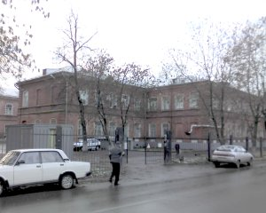
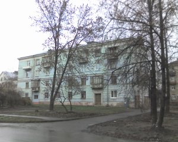
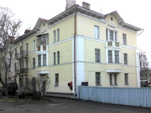
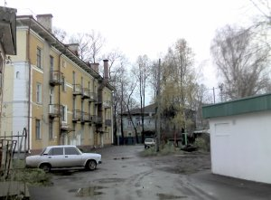
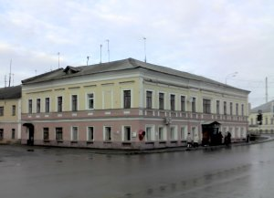
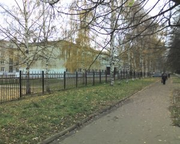
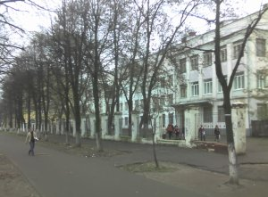

# Мой персональный Ярославль

>
   "У каждого из нас на свете есть места,
   Что нам за далью лет всё ближе, всё дороже.
   Там дышится легко, там мир и чистота
   Нас делают на миг счастливей и моложе".

   Игорь Тальков.

Этот раздел сайта не предназначен для широкого круга читателей. Разве
что родные и друзья найдут здесь что-то интересное, поскольку это
рассказ о местах, связанных с ярославской частью моей биографии.

Это кирпичное здание дореволюционной постройки - больница имени Семашко
в Красноперекопском районе. Здесь 26 апреля 1967 года, около 6 часов
вечера я родился. Вес мой составил 5 килограмм (да, да, “Бедная мама!” - стандартная фраза, произносимая дамами в этом месте рассказа). При
рождении я громко и долго кричал.

В этот дом на улице Чайковского маму и меня привезли из роддома. Наша
семья занимала комнату в коммунальной квартире. С этим жильем связаны
мои первые детские воспоминания. Помню соседей. Тетю Тоню (угощала
пряниками, произнося при этом странную фразу: “Кушай на здоровье,
бабушка коровья”) и дядю Аркашу (славился умением хорошо играть на
аккордеоне, который в день похорон этого доброго старика поставили в
изголовье гроба).

Моя бабушка по отцовской линии - Елизавета Николаевна - работала
простой уборщицей в магазине. При этом, как ни парадоксально, она
обладала недюжинным риэлторским талантом. В результате серии ее
немыслимых комбинаций, наша семья получила трехкомнатную отдельную
квартиру вот в этом доме на Московском проспекте. Квартира размещалась
(да и теперь, конечно, никуда не делась) на втором этаже и имела
необычную форму - обладала эркером, то есть выступом.

Когда осенью 2007 года я делал эти снимки, то заметил, что многие вещи
за 35 лет (мне было лет 5, когда мы туда переехали), не изменились.
Например, в ту пору в этом доме размещалось кафе “Огонек”. Теперь это
заведение называется просто “Столовая”, но по-прежнему работает
(вывеску можно разглядеть в левой части верхнего снимка). Все так же
двор от Московского проспекта отделяет синий деревянный сплошной забор.

Во дворе тоже почти без перемен, хотя похоже, что как раз накануне
моего визита в нем начались какие-то строительные работы. Всё так же
торчит труба котельной (в доме не было центрального отопления и горячей
воды, ее грели в титанах - круглых чугунных печках). Такое ощущение,
что даже песочницу, в которой мы с другом Валеркой строили замки и
закапывали “секретики” из бутылочного стекла сравныли с землей лишь на
днях.

В первозданном виде сохранилась и решетка нашего балкона на втором
этаже. Между ее прутьев когда-то застряла моя дошкольная голова. В
конце двора чернеет забор, под которым я тоже умудрился застрясть,
поскольку перелезть через него, как большие мальчишки, не мог, а
увязаться с ними на запретную территорию соседнего детского садика
очень хотелось.

А это - продовольственный магазин, куда мама отправляла меня
шестилетнего за разливным молоком и другими продуктами. Он работает с
незапамятных времен (думаю, еще с купеческих) до сих пор. С ним у меня
ассоциируется такое словосочетание, как “талоны на сливочное масло”. С
качественным хавчиком в СССР всегда была напряженка.

К сожалению, мои родители развелись, разменяв это прекрасное жилье в
пяти минутах езды от исторического центра города. Мама, только что
родившийся брат Сергей и я переехали в пятнадцатиметровую комнату в
коммунальной квартире вот в этом доме на углу улиц Рыбинской и
Мышкинской (ныне - Лисицына). Папа с бабушкой получили жилье отдельное,
но несравнимое по качеству с квартирой на Московском - хрущевку на
Пятерке, в районе, считавшемся почти окраиной. И если мама осталась с
двумя малолетними детьми на руках, то отцу выпали хлопоты по уходу за
совсем старенькой парализованой бабушкой (моей прабабушкой), а позднее - и за Елизоветой Николаевной.

Наш бывший балкон - на 4-м этаже, его скрывает листва. Зато окно и
балкон соседей по коммуналке (от дерева к углу дома, за исключением
крайнего) видны на снимке хорошо. Соседи были необычными. Желтое
трехэтажное здание, угол которого виден на переднем плане справа,
принадлежит предприятию Общества слепых. Район, в котором мы оказались,
был заселен в немалой степени незрячими и плоховидящими людьми.
Таковыми были и наши соседи - прекрасные, спокойные люди, знавшие цену
взаимопомощи и хорошим человеческим отношениям. Вместо чтения книг они
скрашивали досуг за прослушиванием магнитофонных записей с начитанными
текстами (теперь это называется аудиокнигами). Журналы же, которые они
выписывали, были толщиной с том энциклопедии, поскольку были набраны
азбукой Брайля.

В минуте ходьбы от нашего дома располагалась автобаза, организованная
на территории, принадлежавшей некогда церкви. После Перестройки
предприятие расформировали, а памятник архиректуры отреставрировали. В
детстве я и не подозревал, что живу рядом с историческим местом (о
церквушке на Городском Валу и связанных с ней событиях я написал в
другом материале).

Моя мама не была оригинальна в своих педагогических устремлениях. Ей
очень хотелось, чтобы сын стал образованным, попал в “хорошее общество”
и т.п. Поэтому когда мне пришла пора идти в первый класс, она приложила
много усилий к тому, чтобы меня приняли в школу №42 с углубленным
изучением французского языка. Не получилось. Пришлось идти в первый
класс по месту жительства, в обычную школу №1, которая только что
открылась в новом здании. Маму пугало то, что там еще не было
сложившегося педагогического коллектива, устоявшейся репутации.

Страхи по поводу плохого качества обучения в школе №1 были
преувеличены. Моими однокласниками были дети начальников и специалистов
одного из крупнейших ярославских заводов - ЯМЗ. Раз уж их родители
(только что получившие новые квартиры в новостройках соседнего
микрорайона) не побоялись отдать детей в такое учебное заведение,
значит всё было не так уж плохо. А сегодня школа №1 и вовсе считается
одной из самых благополучных в Ярославле.

А вот с первой учительницей нам действительно не повезло. К работе она
относилась спустя рукава и детей вряд ли искренне любила. Зато с
учительницей, на которую, по требованию родителей, ее заменили спустя
несколько месяцев, повезло сказочно. Лидия Леонидовна Галиуллина -
герой войны, бывшая летчица легендарной женской эскадрильи ночных
бомбардировщиков. Но главное, конечно же, не это. Педагогом она была
отличным (Заслуженый учитель РСФСР), мы ее очень любили. На доме, в
котором она жила, теперь мемориальная доска.

Когда я закончил 4 класса, мама нашла-таки возможность осуществить свою
мечту об обучении старшего сына в какой-нибудь элитной школе,
договорившись о моем переводе в школу с математическим уклоном №33. Ну,
с математическим, так с математическим, благо склонностю к точным
наукам природа нас не обделила.

Хоть и было это сделано не по моему желанию, маме нужно, конечно же,
сказать спасибо. В 33-й школе не только занимались с детьми математикой
сильнейшие в городе специалисты, но и предлагалось много факультативных
занятий. Например, можно было посещать филиал Заочной школы
программирования, базировавшейся при Новосибирском отделении АН (это
1979-80 гг.!). Школьники чуть ли не в обязательном порядке выписывали
журнал “Квант”, и хотя я в нем в свои 11-12 лет почти ничего не
понимал, но некоторые знания, которые не почерпнешь в обычной школе, в
голове, конечно же, откладывались. Например, репродукции картин Эшера,
несложные, но эффектные физические опыты, которые легко можно было
повторить в домашних условиях, ну и, конечно, уроки “Заочной школы
программирования”, домашние задания к которым мы с одноклассниками
решали в отдельных тетрадках и отравляли почтой в Новосибирск.

Самым же важным внеурочным источником знаний для меня стал не школьный
факультатив, а Астрономический кружок Татьяны Лаврентьевны Коровкиной
при Станции юных техников. Это отдельная вселенная, повлиявшая на
формирование моего ума больше, чем многие школьные преподаватели. А
посему рассказ об астрономическом кружке я допишу в следующий раз, так
как только что обнаружилось, что не догадался сфотографировать ни
здание, в котором он размещался, ни обсерваторию, ни некоторые другие
объекты, имеющие отношение к этой одной из самых светлых страниц моего
школьного детства.

Когда я закончил 6-й класс, подошло время идти в школу моему брату
Сергею. У мамы в очередной раз возникло желание пристроить на этот раз
уже его в какую-нибудь особенно “приличную” школу. Выбор пал на 49-ю,
действительно славившуюся успехами в наших окресностях. Там отказали,
мотивировав тем, что территориально мы прикреплены всё к той же школе
№1. Реализации маминых устремлений помогло то, что в этой школе из двух
слишком многочисленных шестых классов в тот момент формировалось три
седьмых. На этот дополнительный класс детей не хватало и Сергея готовы
были принять, если я перейду к ним из 33-й.

У этого варианта были очевидные плюсы: во-первых, мы с братом
оказывались в одной школе, что для него, как для первоклассника, было
важно. Во-вторых, 33-я школа хоть и была элитной, но добираться туда
нужно было минут 20 на всегда переполненном троллейбусе. В-третьих, по
уровню преподавания 49-я не уступала 33-й (за исключением углубленного
преподавания математики), так что 7-й класс я снова начал в новом для
себя окружении.

Новые знакомства пошли на пользу. Шел 80-81-й учебный год - время
повального увлечения магнитофонными записями песен Высоцкого, “мелодий
и ритмов зарубежной эстрады” и сопутствующих занятий радиоэлектроникой.
С моим новым школьным другом Мишкой Яковлевым мы самозабвенно паяли
печатные платы, разыскивали по магазинам (а иногда и свалкам)
дефицитные детали для звуковоспроизводящих устройств и цветомузык,
обменивались магнитофонными записями, коллекционировали вырезки из
газет и журналов о полузапретной в ту пору “рок-музыке” и даже сквозь
шум глушилок слушали по ночам Севу Новгородцева по BBC.

В целом жизнь в 49-й школе была не менее насыщеной, чем в 33-й. К тому
же возраст был уже такой, что предполагал школьные вечера и огоньки,
походы с рюкзаками и палатками, летние трудовые лагеря и все прочее,
что полагалось советским 13-15-летним подросткам. Я продолжал ходить в
астрономический кружок и, если честно, не думаю, что много потерял, не
оставшись в математической спецшколе.

Не остался я,впрочем, и в 49-й, отучившись в ней лишь 7 и 8 классы.
Следующий крутой вираж в своей биографии я сделал уже самостоятельно,
без мамы. Связан он был с тем, что жили мы в обстоятельствах довольно
стесненных: мать с двумя подрастающими сыновьями в коммуналке. Вечная
нехватка денег, да еще в условиях перманентного советского дефицита…
Отец со временем начал неплохо зарабатывать и исправно платил приличные
алименты. И все-таки будущее настораживало. Мысль о том, что я закончу
школу, поступлю в институт и отучусь там 5 лет в голове не
укладывалась. И дело не в том, что не смогу поступить. Учился я без
троек, а такой коррупции в системе высшего образования, когда поступить
можно только по блату или за деньги, в советское время не было. Вопрос
заключался в другом: на какие средства жить все эти институтские годы?

Я принял решение после 8-го класса идти в техникум. Мама была в шоке:
аттестат без троек позволял безбедно закончить 10 классов и открывал
перспективу поступления в вуз. Одноклассники и учителя тоже
недоумевали. Но я настоял на своем. Поначалу хотел пойти в
Железнодорожный техникум на отделение автоматики и телемеханики
(развить свое увлечение радиоэлектроникой). Туда не взяли по здоровью
(у меня врожденный порок сердца). От поступления в Химико-механический
отговорила мама: ездить далеко. А вот вариант с Автомеханическим
техникумом устроил всех: и от дома близко, и отделение автоматизации
есть. Взяли меня без экзаменов (выручил аттестат без троек).
Немаловажным аргументом в пользу поступления в техникум было и то, что
там платили степендию - для нашего бюджета прибавка хоть и скромная, а
не лишняя.

Так закончилось моё школьное детство.

Написано в 2009 г.
