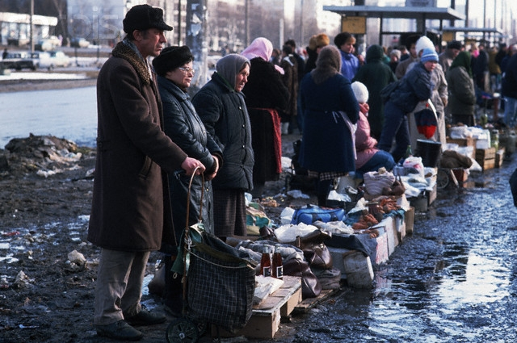

# Розанов и кофточки

В на рубеже 80-х и 90-х годов я “спекулировал” книгами. Часто
приходилось ездить из Ярославля в Питер по семейным делам, и я решил
сыграть на разнице в ценах между провинциальным городом и Северной
столицей. Книги, продающиеся еще за советские 3-5 рублей в Ярославле,
на Невском могли тогда стоить в 5, а то и в 10 раз дороже. Не мудрствуя
лукаво, набил я однажды огромную хозяйственную сумку полиграфической
продукцией и поехал попытать коммерческого счастья.

Ассортимент подобрал не абы какой, а рассчитанный именно на питерскую
интеллигенцию: философия, исторические источники, классика. Я учился
тогда на истфаке ЯрГУ и толк в книгах, как мне казалось, понимал.

С выбором места для торговли в те месяцы рыночной стихии проблем не
было. Лотки и палатки возникали на любом свободном клочке городского
пространства. Я же обнаглел до того, что разложил свой товар прямо на
мраморных подоконниках знаменитого “Дома книги“ на Невском. “Клевать“
стало сразу же. Прохожие расхватывали книги как горячие пирожки.
Видимо, ленинградцы задолго до моих вояжей раскупили советские книжные
запасы, еще сохранявшиеся в провинции. За купленный в ярославском
магазине “Иностранная литература“ (был и такой) полуторарублевый томик
Фрейда класса с бумажной обложкой туристка из Европы заплатила аж 25
рублей. Неплохие деньги по тем временам. Правда, томик был на немецком.
Но на то и гуманитарное образование, чтобы разглядеть во всеми забытой
на полке провинциального магазина книжке ценный источник знаний
прибыли.

Таких рейсов я сделал несколько. Выяснилось даже, что можно в обратный
путь везти шампунь, который уже в Питере стоил в три раза дешевле, чем
в Ярославле. Это был, наверно, самый большой коммерческий успех в моей
жизни. Мы с супругой даже смогли взять в кредит мебель и расплатиться
за нее досрочно (правда, помогла еще и инфляция).

Со временем ситуация стала меняться. Во-первых, появилось много мелких
частных книжных магазинов и легальных лотков. Но подкосило мой бизнес
не это. Однажды, придя как всегда с сумкой томиков к зданию с глобусом
на крыше, я обнаружил, что все мраморные подоконники уже заняты
конкурентами. Кое-как пристроившись с краешка, услышал вежливый, но
твердый голос: “Парень, а у нас здесь бесплатно не торгуют“. Рядом
стоял типичный браток, с налетом, впрочем, некоторой пресловутой
питерской интеллигентности.

— Как так, недавно же можно было.
— Теперь платить надо.
— Кому?
— Мне.
— Сколько?
— Столько-то.
— Но я на столько, может, и не наторгую.
— Дело твое. Или плати, или уходи.

Я предпочел уйти. Но куда деть книги? Сумка-то не маленькая, товар
тяжелый. Стал ходить по тем самым мелким книжным магазинчикам,
предлагать “взять всё оптом”.

— Зря время тратишь, - сказала молодая продавщица в “Букинисте” на углу
площади Восстания. - Нигде ничего не возьмут, рынок насытился. Впрочем,
дай-ка вон тот том.
— Роза’нова?
— Ро’занова, с гримасой снобистского отвращения ответила девушка, молча
взяла книгу, отсчитала деньги и всем видом показала, что разговор
закончен.

Так я узнал, как правильно ставить ударение в фамилии выдающегося
русского философа.

Я потом еще пару раз попытался продавать на Невском книги, и даже
грампластинки, но прежней удачи уже не было. Все доходные места были
заняты местными, и торговать можно было, разве что, через посредников,
что претило моей свободолюбивой натуре. Однажды повез в Питер свою
отличную коллекцию грампластинок, которую собирал долгие годы (тогда
вопрос стоял уже не о шальных деньгах, а о хлебе насущном). Пришел в
магазин “Мелодия” в надежде разложить свой товар где-нибудь в уголке у
входа, но пространство контролировали два братка. Решил попытаться
сбыть товар им. Поковырявшись с кислыми минами в моей сумке, они
сказали, что ничего перспективного для продажи не видят. Я возмутился:
“Вот же фольклорные записи, их иностранцы за валюту с руками оторвут! А
вот, например, роскошный двойной диск с 9-й симфонией Бетховена. Вы в
музыке-то вообще разбираетесь?”. Почесав репы, братки именно эти две
пластинки и купили, причем за вполне сносную цену, хотя в моем
ассортименте были диски не менее ценные. “Дурака учить - только
портить, лучше уж сам свои пластинки слушать буду”, - решил я и
коммерческо-просветительской деятельностью больше не занимался.

Соблазн “навариться” на разнице между ярославскими и питерскими ценами,
тем не менее, остался. Следующий вояж в Северную столицу мы с супругой
совершили в январе 1992 года, когда в стране “отпустили цены”. Это
значило, что можно было что угодно продавать кому угодно без оглядки на
государство. Я справедливо рассудил, что Питер трудно удивить обычными
магазинными товарами, цены на которые там, скорее всего, еще и ниже,
чем в провинции. Поэтому вести туда нужно было что-то очень
экзотическое. Например гаражные замки, которые фрезеовщики полулегально
изготавливали в цеху, где я работал тогда.

Замки в первой же питерской коммиссионке купили с удовольствием,
получилась хорошая прибыль, но возить их большими партиями я не был
готов. Жизненные приоритеты были другими: истово хотелось получить
высшее образование. К тому же замки наши были грубоваты, и мне пришлось
произвести некоторую предпродажную подготовку, придав им более товарный
вид. Думаю, окажись на моем месте расторопный паренек, не обремененный
заботами об образовании, он мог бы сколотить на этих замках хороший
капитал, но я решил, что если коммерция в ущерб учебе, что я выбираю
учебу. Люблю повторять: кто что урвал от разваливавшегося Советского
Союза, а я - бесплатное высшее образование. Если бы я поступил в
универсистет не в 1988 году, а хотя бы на год позже, то мог бы и не
доцчиться, потому что к моменту окончания буже нужно было определяться:
или ты вписываешься в новую экономику, или катишься ко всем чертям.

Привез я в тот раз из Ярославля в Питер и еще один товар, который
нелегально изготавливался в нашем цеху - отличный охотничий нож, но
предложить его так никому и не решился. Думалось, что такая сделка была
бы шагом, приближающим к криминальному миру, а я от него всегда
тщательно дистанцировался. В итоге нож отдал тестю, и говорят,
инструмент этот до сих пор используется при разделке свиных туш.

Мои коммерческие поездки в Северную столицу возобновились через
несколько месяцев уже совсем на другой основе. В ту пору я, как уже
сказано, учился в ЯрГУ. Там познакомился с Рахманом, азербайджанцем по
национальности. Мы стали хорошими друзьями. Дружба эта продолжается до
сих пор, хотя в последние годы видимся всё реже: живем в разных
городах, да и не так легки уже на подъем.

Как и большинство азербайджанцев, Рахман не без успеха занимался
мелкооптовой торговлей, к которой у людей его национальности гораздо
больше способностей, чем у нас, русских. Полностью уйти в бизнес ему
мешало то же, что и мне: хотел закончить вуз. И всё-таки с деньгами у
него было получше, чем у заводчан вроде меня. Как-то раз, когда
финансовый голод в нашей семье принял совсем уж неприличные очертания,
было совсем уж туго (на заводе не платили месяцами), он сказал: “Может,
раз уж в Питер ездишь, привезешь мне партию товара? Глядишь, и билеты
бы за поездку отбил, да и осталось бы еще”. Я решил попробовать.

Рахман специализировался на галантерее. Расчески, зажигалки… даже этого
тогда в магазинах не хватало. Точнее хватало, но по коммерческим
расценкам, хотя многие заводы по инерции еще отдавали товар оптом по
копеечным полусоветским ценам. На этом и делали свою бесхитростную
маржу такие люди, как мой друг. Так российский рынок потихоньку
насыщался товарами, которые в хозяйственных сумках плавно растекались
по стране. В Питере Рахман покупал баллончики для заправки газовых
зажигалок. Небольшой завод по их производству находился на
Петроградской стороне. В первый раз я вполне успешно справился с
заданием: привез в Ярославль целую сумку этого добра, за что получил
вполне приличные деньги. Всё прошло так гладко, что даже вспомнить
нечего. Второй же мой рейс за баллончиками оказался полон драматизма.

Это был, как я теперь припоминаю, конец 1993 года. Наверно, самое
разрушительное для моей молодости время. Завод, на котором я работал
наладчиком, на глазах превращался в театр абсурда. Зарплату задерживали
на месяцы, но и той, что выплачивали, на жизнь не хватало: инфляция.
При этом среди моих сверстников появились такие, кто уже заработал свой
первый миллион. В магазинах и “ларьках” было полно таких желанных
товаров, но их было невозможно купить на те деньги, что платили на
заводе. Люди делились на тех кто уже попробовал “Баунти”, и тех, кто
еще нет. Сейчас это кажется смешным, но то обстоятельство, что не
можешь себе позволить полакомиться кокосовыми опилками воспринималось в
ту пору как принадлежность к какой-то низшей расе.

Конечно, кругом было полно призывов, мол, бросай свой гнилой завод, иди
в бизнес! Но, во-первых, нас столько лет учили, что капитализм это
плохо. Просто так выкинуть эту идеологическую закваску из головы
получалось далеко не у всех. Я был человеком хоть и молодым, но вполне
советской закалки и против социализма в его поздних советских
проявлениях ничего не имел. На референдуме голосовал “нет-нет-да-нет”,
и всё такое. Во-вторых, уйти с завода - дело не хитрое, но куда? Я
совершенно никого не знал в том кругу, который вел свое происхождение
от советских подпольных цеховиков и фарцовщиков. В-третьих, написав что
“уйти с завода - дело не хитрое” я выразился крайне неточно. Хитрое,
еще и какое хитрое. В заводской среде бытовали такие стереотипы, как
“Летун - враг производства”, “Не порти себе трудовую книжку” и т.п.
Самое же главное - работать на заводе наладчиком по запуску нового
оборудования мне нравилось. Как раз в то время появлялись станки с
программоконтроллерами, ЧПУ переставало быть экзотикой, я за несколько
лет уже набрался опыта, ездил в командировки принимать купленные для
цеха станки… “Разве можно всё это вот так бросить? А что до трудностей,
так они же временные, они пройдут, как кошмарный сон, иначе и быть не
может”, - думалось тогда.

Но экономические передряги общенационального масштаба всё не
заканчивались, а с общенационального расползались, как раковые клетки,
до каждой ячейки общества. Мало-помалу усиливался криминал (еще одна
причина, по которой не хотелось уходить с окруженного забором завода),
и укрыться от него стало невозможно даже за заводским забором. Однажды
у меня взломали шкафик в рабочей раздевалке, утащили всю одежду (случай
в нашем цеху небывалый). Это было зимой. Слова “всю одежду” имеют здесь
буквальный смысл: другой не было. Пришлось ехать домой в надетой поверх
промасленной спецовки чистой служебной фуфайке, одолженной сердобольным
технологом. Новый комплект одежды удалось собрать с трудом. Пальто
помогли купить родственники (у них были какие-то ветеранские талоны,
без которых приобрести что-то стоящее из гардеробы было невозможно,
если не считать неподъемных коммерческих вариантов). Пиджак пришлось
купить до того нелепый, что насилу к нему привык. Предыдущий,
украденный, хоть и был он из комиссионки, я любил всей душой: похожий
на френч, он, в сочетании с джинсами и лохматой головой, позволял мне
выглядеть стильно даже на фоне тогдашних мажоров.

Выживала наша семья тогда за счет двух финансовых источников.
Во-первых, в нашей непьющей семье всегда были талоны на водку. Ее
выкупали по “госцене”, а продавали по рыночной. Так делали многие.
Во-вторых, я вспомнил о своем давнишнем опыте, когда еще в начале 80-х
написал однокурснику расчетную работу в обмен на магнитоальбом группы
Queen. Я начал писать курсовые и дипломы на заказ, став, кстати, одним
из пионеров этого рынка в нашем городе.

Тем временем экономическая ситуация и в стране, и в семье усугублялась
и, вопреки привитому комсомолом задору, наделявшему уверенностью, что
молодых сил хватит на преодоление любых трудностей, нервы начинали
сдавать. Напомню, что с 1988 года я еще и учился на вечернем отделении,
и к 1993-му от совмещения работы на заводе, учебы и государственной
шоковой терапии организм порядком поизносился. Кроме того, я уже был
женат, не за горами было рождение ребенка. Вот в таком состоянии я
второй раз отправился в Питер по поручению Рахмана.

Производство баллончиков тоже, видимо, переживало не лучшие времена.
Рахман об этом знал, и предупредил, что на складе того заводика может
ничего и не оказаться. “Тогда сам походи, подумай, какой товар было бы
выгодно привезти из Питера в Ярославль”, - сказал он, вручая мне перед
поездкой 200 долларов на оптовую закупку.

Питер в тот раз встретил меня неласково. Баллончиков на складе
действительно не оказалось, и я стал думать, как, во-первых, скоротать
время до обратного поезда, во-вторых, что можно купить на 200 долларов,
чтобы не возвращаться в Ярославль с пустыми руками. Вдобавок стоял
мороз, с залива дул сырой ветер, и я впервые понял, как герои
Достоевского гробили своё здоровье в этом, казалось бы, таком
привлекательном городе. Меня вдруг пробил такой душераздирающий, сухой,
почти кровавый кашель, что я даже не испугался, а пришел в недоумение:
неужели такое бывает?

Судя по тому, что стемнело быстро, дело было, похоже, в середине
декабря. Точнее вспомнить дату поездки не получается. Я шел по
Московскому проспекту, волоча за собой пустую хозяйственную сумку. Как
я туда попал с Петроградской стороны - ума не приложу, но подозреваю,
что спросил у кого-то из местных где тут можно повыгоднее затовариться.
Магазины в ту пору действительно представляли собой и розничные точки,
и мелкооптовые склады одновременно: если берешь много - делали
приличную скидку. Одет я был вызывающе провинциально, и если сесть на
машину времени и привезти из XIX века И.Е. Репина, а потом на той же
машине времени съездить с ним в декабрьский Питер 1993 года, то он мог
бы написать с тогдашнего меня великий шедевр под названием “Лох”.

Я тем временем добрался до универмага “Московский” и стал ходить от
прилавка к прилавку, рассматривая товар (в основном там были одежда и
обувь, в чем я совсем не разбирался). Уныло растягивая время,
оставшееся до поезда, я вдруг почувствовал деликатное постукивание по
плечу и обращенные ко мне слова: “Коллега!”. Коллега? Я? Обернувшись,
увидел молодую женщину в натуральной шубе до пят. Лицо ухоженное,
смугловатое, стильная стрижка до плеч, полупрозрачные очки, парфюм…
“Коллега”, - сказала фея с иностранным акцентом. - “Мы коммерсанты из
Венгрии, наш автобус отправляется через полчаса, но мы не успели
реализовать весь товар. Может, выручите, возьмете оптом, отдам за
символическую цену”.

То, что туристы из Венгрии чем-то торгуют с рук не показалось мне
удивительным. Этим жила в те времена едва ли не половина Восточной
Европы. Двухэтажный зарубежный автобус серебристого цвета действительно
был виден метрах в ста от универмага, причем он явно был уже в ожидании
отправки, судя по дымку из выхлопной трубы. Да и волнение дамы было
очень натуральным. Однако вложить в ее товар 200 долларов я не был
готов. Тогда она сказала: “Если не верите, пойдемте спросим у любого
продавца в этом универмаге, сколько стоит этот трикотаж. Вы сами
сможете посчитать прибыль”. Я согласился.

Парень за ближайшим прилавком сказал, что такие кофточки (а это были
именно розового цвета женские кофточки), стоят у него в 5 раз дороже по
сравнению с оптовой ценой, по которой предлагала “коллега”. Тут я решил
быкануть: “Почем я знаю, может вы с этим парнем в сговоре? Надо еще у
кого-нибудь спросить”. - “Пожалуйста”, - ответила смуглянка, и мы пошли
в другой конец магазина, где продавец , выбранный уже мной, подтвердил
примерно тот же экономический расклад. И тем не менее, покупать я не
хотел, говорил, что в этом не разбираюсь, но “коллега” умоляла, с таким
отчаянием посматривала а автобус, а перспектива удивить Рахмана удачной
сделкой казалась такой заманчивой, что я решил рискнуть.

Смуглые руки, получив 200 долларов, добросовестно перекидали из ее
большой сумки в мою, предназначавшуюся для газовых баллончиков,
несколько десятков розовых кофточек. Дама скрылась в направлении
автобуса, оставив меня в тяжких раздумьях. Надежда, что я совершил
удачную сделку, была еще жива, но что-то мне подсказывало, что я только
что подарил “коллеге” рахмановы 200 баксов.

Из ступора меня вывело то, что времени было уже много, до отправления
поезда в Ярославль оставалось около часа, и я двинул в направлении
метро. Не помню, почему я не поехал до Площади Восстания, а вышел у
Гостиного двора (не на ту ветку, может, сел). Помню только, что увидел
молодую цыганку, которая традиционно попрошайничала, сидя, несмотря на
мороз, на мостовой. Почему-то я остановился рядом с ней и, нимало не
стесняясь, заговорил как со старой знакомой: “Слушай, только что товар
купил, не посмотришь, стоящий он?” Она очень дружелюбно ответила:
“Давай, посмотрю”. Я открыл сумку. На ее лице появилась задумчивость, и
доброжелательным, но уклончиво-вежливым голосом девушка поведала, что
реализовать это будет трудно не только с пятикратной прибылью, но и по
себестоимости. Я окончательно понял, что попал, и… успокоился.

Придя на следующее утро в общежитие к Рахману, я “порадовал” его
новостью о своей суперсделке и заметил, что выражение его лица с
приветливого сменилось примерно на такое же задумчивое, как у вчерашней
цыганки. Помолчав немного, он сказал: “Мы с тобой друзья, но в деловых
отношениях есть определенные правила, поэтому мы сейчас пойдем к
кому-нибудь третьему, чтобы ты не подумал, что я хочу тебя обмануть”.
Мы пошли к одной из множества знакомых продавщиц Рахмана, и она
подтвердила, что ни о какой прибыли с этого товара не может быть и
речи. Потом еще к одной, где прозвучало то же самое. “Вот видишь… А
деньги… Отдашь когда-нибудь”, - туманно произнес Рахман, и перевел
разговор на другую тему.

Рахман - воплощение кавказского благородства. Он не напоминал про долг,
но долг не давал спать мне. Поэтому я занял 200 долларов у
родственников, справедливо рассудив, что уж лучше буду должен им.
Выплатил потихоньку, куда ж деваться. Но самая удивительная метаморфоза
произошла с розовыми кофточками. Моя супруга умудрилась распихать их по
комиссионным магазинам, и за несколько недель они, хоть и без прибыли,
все были распроданы.

   Поделиться

   [avatar.png]

Длинные тексты

     * [7]Моя «Снежеть»
     * [8]История кота Зухеля
     * [9]Розанов и кофточки
     * [10]Книжки - моё хобби
     * [11]Nihil humanitatum
     * [12]"Тысячерублевая" экскурсия
     * [13]Секреты ярославских набережных
     * [14]Башни, стены и валы
     * [15]Мой персональный Ярославль
     * [16]Гравюры Спартака Глушкова
     * [17]IT's my life

Категории

     * [18]видео
     * [19]изображения
     * [20]тексты
     * [21]цитаты

Облако меток

   [22]IT [23]english [24]Австралия [25]Америка [26]Африка [27]Булгаков
   [28]Восток [29]Европа [30]Марк Твен [31]Поланик [32]Россия [33]СССР
   [34]США [35]Сталин [36]Суворов [37]ТВ [38]Цицерон [39]Черчилль
   [40]Эренбург [41]аллюзии [42]анекдоты [43]антропология [44]археология
   [45]архитектура [46]архитертура [47]астрономия [48]байки [49]барды
   [50]басни [51]биология [52]блюз [53]война [54]география [55]геология
   [56]даты [57]демография [58]джаз [59]династии [60]древность
   [61]естествознание [62]живопись [63]зарубежный рок [64]зоология
   [65]искусство [66]история [67]капитализм [68]катастрофы [69]кино
   [70]классическая музыка [71]князь Александр Михайлович [72]корпорации
   [73]космос [74]краеведение [75]криминал [76]культура [77]культурология
   [78]курьезы [79]лингвистика [80]литеатура [81]литература
   [82]манускрипты [83]медицина [84]мемуары [85]мифология [86]музей фактов
   [87]музыка [88]музыка настроения [89]мультфильм [90]народная музыка
   [91]настроение [92]нейрология [93]ностальгия [94]нумизматика
   [95]образование [96]оргвопросы [97]оружие [98]отечественный рок
   [99]палеонтология [100]память [101]педагогика [102]перашки
   [103]персоналии [104]письменность [105]повседневность [106]политика
   [107]политология [108]популярная музыка [109]поэзия [110]право
   [111]праздники [112]приветствие [113]природа [114]притчи [115]промыслы
   [116]развлечения [117]реконструкции [118]религия [119]ремесло
   [120]русский рок [121]русский язык [122]сатира [123]советская эстрада
   [124]современность [125]социология [126]спорт [127]средневековье
   [128]статистика [129]стихия [130]театр [131]тексты [132]технологии
   [133]традиции [134]транспорт [135]физика [136]физиология [137]философия
   [138]фольклор [139]фото [140]футурология [141]хронология [142]цитаты
   [143]частушки [144]шоу [145]экология [146]экономика [147]эпос
   [148]этика [149]этническая музыка [150]этнография [151]юмор

Архив

     * [152]апрель 2017
     * [153]март 2016
     * [154]январь 2016
     * [155]декабрь 2015
     * [156]ноябрь 2015
     * [157]октябрь 2015
     * [158]сентябрь 2015
     * [159]август 2015
     * [160]июль 2015
     * [161]июнь 2015
     * [162]май 2015
     * [163]апрель 2015
     * [164]март 2015
     * [165]февраль 2015
     * [166]январь 2015
     * [167]декабрь 2014
     * [168]ноябрь 2014
     * [169]октябрь 2014
     * [170]сентябрь 2014
     * [171]август 2014
     * [172]июль 2014
     * [173]июнь 2014
     * [174]май 2014
     * [175]апрель 2014
     * [176]март 2014
     * [177]февраль 2014
     * [178]январь 2014
     * [179]декабрь 2013
     * [180]ноябрь 2013
     * [181]октябрь 2013
     * [182]сентябрь 2013
     * [183]август 2013
     * [184]июль 2013
     * [185]июнь 2013

   © 2017 Михаил Беляков
   Создано с помощью [186]Hexo

   [187]Главная [188]Архив

Ссылки

   Видимые ссылки
   1. file:///atom.xml
   2. file:///
   3. file:///
   4. file:///
   5. file:///archives
   6. file:///rozanov/index.html
   7. file:///sneget
   8. file:///zyxel
   9. file:///rozanov
  10. file:///stimul
  11. file:///human
  12. file:///yar1000r
  13. file:///yarsecrets
  14. file:///yartowers
  15. file:///yarperson
  16. file:///spartak_glushkov
  17. file:///it
  18. file:///categories/видео/
  19. file:///categories/изображения/
  20. file:///categories/тексты/
  21. file:///categories/цитаты/
  22. file:///tags/IT/
  23. file:///tags/english/
  24. file:///tags/Австралия/
  25. file:///tags/Америка/
  26. file:///tags/Африка/
  27. file:///tags/Булгаков/
  28. file:///tags/Восток/
  29. file:///tags/Европа/
  30. file:///tags/Марк-Твен/
  31. file:///tags/Поланик/
  32. file:///tags/Россия/
  33. file:///tags/СССР/
  34. file:///tags/США/
  35. file:///tags/Сталин/
  36. file:///tags/Суворов/
  37. file:///tags/ТВ/
  38. file:///tags/Цицерон/
  39. file:///tags/Черчилль/
  40. file:///tags/Эренбург/
  41. file:///tags/аллюзии/
  42. file:///tags/анекдоты/
  43. file:///tags/антропология/
  44. file:///tags/археология/
  45. file:///tags/архитектура/
  46. file:///tags/архитертура/
  47. file:///tags/астрономия/
  48. file:///tags/байки/
  49. file:///tags/барды/
  50. file:///tags/басни/
  51. file:///tags/биология/
  52. file:///tags/блюз/
  53. file:///tags/война/
  54. file:///tags/география/
  55. file:///tags/геология/
  56. file:///tags/даты/
  57. file:///tags/демография/
  58. file:///tags/джаз/
  59. file:///tags/династии/
  60. file:///tags/древность/
  61. file:///tags/естествознание/
  62. file:///tags/живопись/
  63. file:///tags/зарубежный-рок/
  64. file:///tags/зоология/
  65. file:///tags/искусство/
  66. file:///tags/история/
  67. file:///tags/капитализм/
  68. file:///tags/катастрофы/
  69. file:///tags/кино/
  70. file:///tags/классическая-музыка/
  71. file:///tags/князь-Александр-Михайлович/
  72. file:///tags/корпорации/
  73. file:///tags/космос/
  74. file:///tags/краеведение/
  75. file:///tags/криминал/
  76. file:///tags/культура/
  77. file:///tags/культурология/
  78. file:///tags/курьезы/
  79. file:///tags/лингвистика/
  80. file:///tags/литеатура/
  81. file:///tags/литература/
  82. file:///tags/манускрипты/
  83. file:///tags/медицина/
  84. file:///tags/мемуары/
  85. file:///tags/мифология/
  86. file:///tags/музей-фактов/
  87. file:///tags/музыка/
  88. file:///tags/музыка-настроения/
  89. file:///tags/мультфильм/
  90. file:///tags/народная-музыка/
  91. file:///tags/настроение/
  92. file:///tags/нейрология/
  93. file:///tags/ностальгия/
  94. file:///tags/нумизматика/
  95. file:///tags/образование/
  96. file:///tags/оргвопросы/
  97. file:///tags/оружие/
  98. file:///tags/отечественный-рок/
  99. file:///tags/палеонтология/
 100. file:///tags/память/
 101. file:///tags/педагогика/
 102. file:///tags/перашки/
 103. file:///tags/персоналии/
 104. file:///tags/письменность/
 105. file:///tags/повседневность/
 106. file:///tags/политика/
 107. file:///tags/политология/
 108. file:///tags/популярная-музыка/
 109. file:///tags/поэзия/
 110. file:///tags/право/
 111. file:///tags/праздники/
 112. file:///tags/приветствие/
 113. file:///tags/природа/
 114. file:///tags/притчи/
 115. file:///tags/промыслы/
 116. file:///tags/развлечения/
 117. file:///tags/реконструкции/
 118. file:///tags/религия/
 119. file:///tags/ремесло/
 120. file:///tags/русский-рок/
 121. file:///tags/русский-язык/
 122. file:///tags/сатира/
 123. file:///tags/советская-эстрада/
 124. file:///tags/современность/
 125. file:///tags/социология/
 126. file:///tags/спорт/
 127. file:///tags/средневековье/
 128. file:///tags/статистика/
 129. file:///tags/стихия/
 130. file:///tags/театр/
 131. file:///tags/тексты/
 132. file:///tags/технологии/
 133. file:///tags/традиции/
 134. file:///tags/транспорт/
 135. file:///tags/физика/
 136. file:///tags/физиология/
 137. file:///tags/философия/
 138. file:///tags/фольклор/
 139. file:///tags/фото/
 140. file:///tags/футурология/
 141. file:///tags/хронология/
 142. file:///tags/цитаты/
 143. file:///tags/частушки/
 144. file:///tags/шоу/
 145. file:///tags/экология/
 146. file:///tags/экономика/
 147. file:///tags/эпос/
 148. file:///tags/этика/
 149. file:///tags/этническая-музыка/
 150. file:///tags/этнография/
 151. file:///tags/юмор/
 152. file:///archives/2017/04/
 153. file:///archives/2016/03/
 154. file:///archives/2016/01/
 155. file:///archives/2015/12/
 156. file:///archives/2015/11/
 157. file:///archives/2015/10/
 158. file:///archives/2015/09/
 159. file:///archives/2015/08/
 160. file:///archives/2015/07/
 161. file:///archives/2015/06/
 162. file:///archives/2015/05/
 163. file:///archives/2015/04/
 164. file:///archives/2015/03/
 165. file:///archives/2015/02/
 166. file:///archives/2015/01/
 167. file:///archives/2014/12/
 168. file:///archives/2014/11/
 169. file:///archives/2014/10/
 170. file:///archives/2014/09/
 171. file:///archives/2014/08/
 172. file:///archives/2014/07/
 173. file:///archives/2014/06/
 174. file:///archives/2014/05/
 175. file:///archives/2014/04/
 176. file:///archives/2014/03/
 177. file:///archives/2014/02/
 178. file:///archives/2014/01/
 179. file:///archives/2013/12/
 180. file:///archives/2013/11/
 181. file:///archives/2013/10/
 182. file:///archives/2013/09/
 183. file:///archives/2013/08/
 184. file:///archives/2013/07/
 185. file:///archives/2013/06/
 186. http://hexo.io/
 187. file:///
 188. file:///archives

   Скрытых ссылок:
 190. file://localhost/atom.xml
