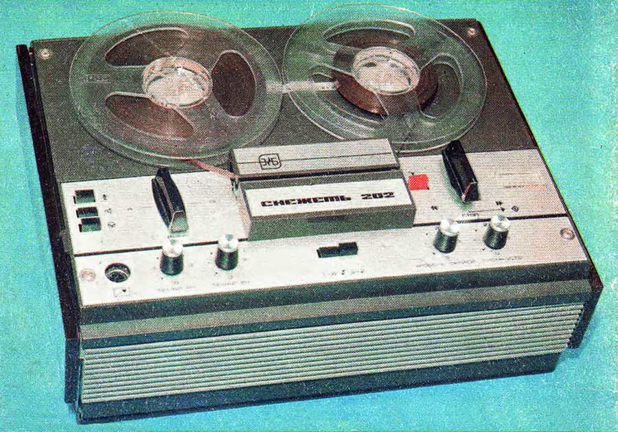

# Моя «Снежеть»

Время действия - 1982 год, мне 14. Главными увлечениями ребят моего
круга были популярная музыка и радиоэлектроника. Две эти сферы
деятельности были неразрывно связаны, т.к. вторая решала проблемы
первой. Раздобыть приличные аудиозаписи легальным путем в СССР было
трудно. Грампластинки действительно популярных групп выпускались очень
маленькими тиражами. Многие музыкальные направления (по нынешним
временам вполне безобидные) были и вовсе запрещены. Можно было купить
записи на черном рынке, но там они стоили чудовищно дорого (иной диск -
как зарплата инженера за месяц). Спасенья было два: магнитофон и
радиоприемник. Эти бытовые устройства, хоть и не без некоторых
сложностей, можно было раздобыть и в обычной торговой сети, но высшим
шиком считалось собрать их собственноручно из радиодеталей.

Мечтой самостоятельно собирать аппаратуру были одержимы все, кто не мог
себе позволить купить ее за деньги. В их числе был и я, поскольку жили
мы с мамой и братом бедновато. Зато у нас был агрегат “Романтика”,
доставшийся маме после развода. Это было устройство класса “комбайн”,
т.е. эдакий музыкальный центр, совмещавший в себе радиоприемник,
проигрыватель грампластинок и(!) магнитофон. Последняя составляющая
была самой важной, поскольку интересных пластинок, как я уже сказал,
продавалось мало (но их можно было у кого-нибудь одолжить и переписать
на магнитную ленту), а по радио если и передавали изредка годную
музыку, то ведь надо было ее как-то сохранить для повторного
прослушивания (опять-таки пригождается магнитофон).

Агрегат “Романтика” был выполнен в лучших радиоламповых традициях и
размеров был колоссальных, а посему был начисто лишен одного из главных
необходимых качеств - мобильности. Музыка ведь распространялась
посредством меломанских походов друг к другу в гости. Кто-то брал свой
аппарат и шел к обладателю другого подобного. Магнитофоны соединялись
электрошнурами и музыка с одного переписывалась на другой, пока
владельцы проводили время за распитием чая (об этом хорошо повествует
БГ в одном из своих “Аэростатов”).

Отнести нашу “Романтику” к кому-то в гости не представлялось ни
малейшей возможности. А вот ко мне иногда приходили друзья-меломаны, и
нам удавалось что-то копировать с магнитофона на магнитофон. Но
происходило это с большим трудом: то соединительные шнуры не подойдут,
то изношенный механизм “комбайна” зажует ленту… В общем, романтичного
было мало, и проблему нужно было решать. О покупке нового магнитофона я
не мог и мечтать, его цена превышала месячный доход нашей семьи.

На тот момент я уже интересовался радиоэлектроникой, хотя больше
теоретически. Жизнь в комнате коммунальной квартиры мало располагает к
созданию нормального рабочего места, где можно что-то полноценно
мастерить. Тем не менее, я пытался что-то паять, выписывал технические
журналы. Успехи были очень скромные, но в 14 лет мало кто способен
трезво рассчитать свои силы.

Заглянув несколько раз под заднюю панель нашей “Романтики”, я решил,
что смогу сам переделать ее во что-то приличное. План был такой.
Изнутри аппарат состоял из довольно четко структурированных четырех
узлов: блока питания, проигрывателя, радиоприемника и собственно
магнитофона. Я решил пожертвовать первыми двумя ради того, чтобы,
объединив магнитофон с блоком питания, изготовить более-менее
компактный аппарат, который можно было бы носить в гости для перезаписи
музыки. Схема электрическая принципиальная прилагалась, так что
рискнуть очень хотелось, однако было одно серьезное препятствие в лице
мамы.

Мама вовсе не собиралась отдавать “комбайн” на растерзание. К моему
увлечению музыкой она относилась одобрительно и даже, по моим просьбам,
раздобывала у коллег по работе магнитофонные ленты с записями модных
групп. Однако у нее были и свои любимые записи и пластинки, да и радио
“Маяк” она слушала каждый день. Так что, узнав о моем проекте, в
восторг она не пришла. Но преобразовательский зуд был просто
космического масштаба, и я решил пойти на преступление.

В те времена с продуктами в советской нечерноземной провинции было
туго, так что всё взрослое население регулярно садилось на специальные
“колбасные” электрички и совершало продовольственные набеги на столицу.
Дело это было тяжелое, занимало весь день. Выйдя из дома часов в 6
утра, человек, нагруженный котомками с колбасой, возвращался домой лишь
к полуночи. Вот в один из таких дней, когда мама поехала в Москву, я и
взялся за пассатижи… Вернувшись ночью домой она обнаружила
раскуроченную на четыре части “Романтику” и сына, в глазах которого
читалось чувство захватывающих музыкальных перспектив вперемежку с
отчаянием от совершенного.

Восторга мама не изъявила, но и ругать сильно не стала. Может по
причине усталости от поездки в Москву, а может и потому, что тоже
понимала актуальность проблемы магнитофона и необходимость в этом деле
революционных мер. “Попробуй”, - сказала она. Трагическая трансформация
“комбайна” имела один неожиданный плюс: места в 15-метровой комнате
стало существенно больше. Однако места на то, чтобы полноценно
заниматься решением проблемы объединения блока питания с магнитофоном
по-прежнему было недостаточно. Состыковать-то их мне удалось, но
оказалось, что некоторые необходимые узлы (кнопки управления, усилитель
мощности) намертво прикручены к радиоприемнику. При этом соединен он с
прочими узлами таким запутанным пучком проводов, что разобраться в нем
у меня так и не хватило терпения (учитывая, что постоянно приходилось,
за неимением постоянного рабочего места, всё это то раскладывать, то
вновь куда-то убирать). Кроме того, нужно было упрятать
перекомбинированный “комбайн” в какой-то приличный корпус. Выбор пал на
фанеру, но резать и шлифовать ее в ограниченном жилом пространстве
оказалось непросто. В общем, наполеоновский принцип “ввяжемся в бой, а
там посмотрим”, не сработал. Через несколько недель всем (и даже мне)
стало понятно, что силы свои я переоценил, и дело гиблое.

“Ну что-ж”, - сказала мама. - “Придется покупать новый магнитофон”. Я
даже не обрадовался этим словам, потому что прекрасно знал, что деньгам
на такое приобретение взяться просто неоткуда. На мой немой вопрос она
продолжила: “Тебе 15 лет скоро, уже могут взять на завод. Летом
заработаешь и купим”. К этим словам я отнесся с некоторым недоверием,
но факт есть факт: летом меня через знакомых действительно устроили в
сборочный цех ЯМЗ. По советскому законодательству 15-летних подростков
вполне можно было брать на работу, но трудиться им по КЗоТу полагалось
не более 4 часов, так что о крупных заработках, вроде как, мечтать не
приходилось. Однако были два корректирующих обстоятельства. Во-первых,
меня отдали не абы куда, а под присмотр знакомых, которые следили,
чтобы по отношению ко мне не было допущено никаких несправедливостей.
Во-вторых же… Но тут надо начинать новый абзац.

В цеху сборки и испытаний моторов (СИМ-3) собирали на конвейере
12-цилиндровые двигатели для тракторов “Кировец”. Можно представить,
как 15-летнему пацану там всё нравилось. Однако поручили мне поначалу
работу самую бабскую: вставлять маленькие пружинки в резиновые
манжетки, защищающие клапана головки блока от утечек масла
(автомобилисты поймут). Выполняя ежедневно нехитрую норму, я около
полудня, в полном соответствии с советским КзОТом, заканчивал работу,
шел в раздевалку, умывался и ехал домой. Всякий раз испытывал при этом
чувство неловкости: все работают, а я уже освободился.

Непосредственным моим руководителем был мастер Володя, который поначалу
просто отдал меня не попечение пожилых работниц. Где-то через неделю
Володя подошел ко мне и предложил поучаствовать “в настоящем деле”:
выйти в субботу “на шабашку”. И тут я узнал один из больших секретов
советской промышленности. Оказывается, в течение рабочей недели
производство не шатко не валко текло по законам социализма:
уравниловка, бюрократия, планы срываются, нормы не выполняются… Но за
сверхурочный выход на работу (в ту же субботу, например) полагалась
двойная оплата, а то и вовсе какие-то бешеные аккордные. Получалось,
что за один день мощно замотивированные длинным рублем работяги
выполняли недельное задание. Но трудиться приходилось действительно на
полную катушку. “После такой работы на бабу уже не залезешь”, - услышал
как-то я от соседа по конвейеру в конце одной из таких шабашек.

В общем, на шабашки я выходил все недели, пока работал тем летом на
заводе (а продолжалось это месяца полтора). Оказалось, что 15-летний
подросток не 4, а 10 часов может вкалывать наравне со взрослыми.
Впрочем, в таком возрасте труд в радость, тем более, что кадровые
работники, которым конвейерное однообразие давно приелось, охотно
допускали меня к самым сложным и трудоемким (а значит интересным)
операциям. Напрыгался я со всевозможными гайковертами, и кувалдой
намахался от души, и на кнопки кран-балки нанажимался, и
птевмомолотками всех калибров настучался, и даже огромный конвейер с
12-цилиндровыми двигателями сам выключал и включал, если вдруг
случались какие-то заминки. Зато и чувство настоящей физической
вымотанности или, как тогда говорили, “удовлетворения от труда”,
испытал. Хорошее чувство, если оно сопровождается мыслями о том, что
вся жизнь впереди, и что в проезжающем по улице “Кировеце”, возможно,
работают собранные твоими руками узлы. А главное - магнитофон всё
ближе…

Срок моего временного трудоустройства близился к концу, и всё чаще
приходила в голову мысль: “А сколько денег-то дадут? Хватит ли?”.
Заплатили хорошо, нужно отдать должное маминым знакомым,
контролировавших процесс. Если бы не они, денег могло быть раза в два
меньше. Пишу так потому, что на следующий год я устроился на летнюю
подработку к тому же Володе, но уже по собственной инициативе, без
“блата”. Да еще и друга сагитировал. Работали на полную катушку, но
заплатили нам до обидного мало. Вот что значит хорошая “крыша”. Однако
думаю, что и мое участие в шабашках не последнюю роль сыграло в том,
что на руки я получил сумму, сопоставимую с зарплатой кадрового
сборщика. Более 200 рублей. Это было не мало по тем временам, на
аппарат второго класса хоть и с натяжной, но хватало.

Магнитофон в продаже еще нужно было найти. Мы с мамой пару недель
прилежно посещали магазины бытовой техники, но подходящего товара не
видели. Были или очень дорогие (“Олимп”, “Сатурн”), или совсем уж
простенькие, третьего класса, у которых из достоинств только
компактность. Наконец появилось сразу два подходящих: стереофонический
“Маяк” и монофоническая, но зато четырехдорожечная “Снежеть”. “Маяк”
стоил чуть больше, чем заработанная мной сумма, и мама предлагала
добавить из семейного бюджета, чтобы купить вещь попрестижнее. Меня же
в первую очередь интересовала проблема собственности: магнитофон должен
быть мой и только мой. Поэтому я выбрал “Снежеть”, и жизнь моя
изменилась навсегда.

Став обладателем магнитофона, я превратился в полноценного члена
меломанского сообщества. Теперь я ходил к школьным друзьям с
портативным (12 кг) аппаратом и за считаные недели обзавелся всеми
модными записями, о которых так долго мечтал: и тебе “ABBA”, и
“Boney-M”, и “Smokie”, и Демис Русос, и Джо Дассен, и Адриано
Челентано… Учитывая же, что осенью того года я поступил в техникум,
круг моих музыкальных знакомств и интересов еще более расширился.

Процесс перезаписи происходил так. Придя в гости со своим катушечным
железным другом и чемоданом бобин с лентой (а это 12 килограмм веса),
нужно было состыковать свой магнитофон с хозяйским, порой весьма
экзотическим и/или раритетным, затем отрегулировать “уровень сигнала“
(стрелочка на транзисторном магнитофоне или особая зеленая лампа с
переменным сегментом свечения на ламповом). Аппараты включали - один на
запись, другой на воспроизведение - и, пока идет процесс, пили чай и
беседовали. На такие сеансы нередко собиралось по несколько человек и
затягивались они, иной раз за полночь. Только сейчас понимаю, что в
конечном счете всех не так уж и интересовало, чем пополнить свою
аудиоколлекцию. Есть Iron Maiden? Давай запишем. А, вот еще и Yello у
тебя есть? Запишем на обратную сторону, может послушаю. Хотя, казалось
бы, какая между этими высокохудожественными коллективами связь…
Аудиовсеядность компенсировалась душевностью (не путать с духовностью)
и романтикой, ощущением причастности к чему-то полузапретному (нас
больше пугало тогда не нарушение авторских прав, о которых и понятия не
имели, а выговор по комсомольской линии, который в начале 80-х за
прослушивание идеологически чуждой музыки еще вполне можно было
схлопотать).

Бобина с записью Queen, полученная в качестве платы за написанную для
однокурсника курсовую работу, стала моей дверью в мир западной
рок-музыки. На старших курсах техникума, в отличие от охломонов,
слушавших AC/DC, Iron Maiden и прочий металл, я приобщился к творчеству
The Beatles, собрав все их альбомы, и даже альбомы отдельных битлов,
выпущенные после распада группы. Несколько месяцев ходил я и в КСП
(клуб самодеятельной песни), где можно было брать домой пленки из
фонотеки. Ну и, конечно, не просто кумиром, а богом моих музыкальных
пристрастий был В.С. Высоцкий. Большинство его песен я знал наизусть
(да и сейчас припомню, если постараюсь).

Помимо обмена записями и их переписыванием был еще один источник
популярной музыки: коротковолновое радио. При определенном усердии
можно было поймать в эфире зарубежные радиопередачи. Самым вожделенным
уловом были музыкальные выпуски BBC, подготовленные Севой
Новгородцевым. Их глушили советские спецслужбы, но иногда удавалось
записать на магнитофон и их. Нередко (особенно ближе к середине 80-х)
стала появляться хорошая музыка и на отечественных радиостанциях и даже
по телевидению. Была даже рубрика на “Маяке” - “Запишите на свой
магнитофон”. Не брезговали и этим.

Киоски звукозаписи (а также закутки в домах быта и прочие, порой весьма
неожиданные, помещения) - еще одно колоритное явление советской
меломанской повседневности. Входишь туда, бывало, и проникаешься
священным трепетом к владельцам такого большого количества шикарных
магнитофонов и еще более шикарных (как тогда казалось) аудиоколлекций.
Правда, цены там были не самые демократичные и я, например, в таких
заведениях заказывал себе записи лишь пару раз. Одно приобретение точно
могу назвать - [7]“Agnetha Faltskog & Smokie“ (довольно посредственный
альбом, зря деньги потратил, хотя, конечно, Агнетта есть Агнетта). И
всё же, проходя мимо салонов звукозаписи, трудно было удержаться, чтобы
не заглянуть туда. Хоть списки модных альбомов и групп почитать. О
киосках звукозаписи хороший материал [8]здесь

Магнитофон стал неотъемлемой частью моей юности, почти частью тела. А
уж как я на ним ухаживал! И пластмассовые части с мылом-то мыл, и
магнитные головки лучшим одеколоном протирал, и смазку в соответствии с
техническим регламентом производил. Одно было плохо: качественная лента
стоила дорого, и мы покупали дешевую “школьную”, которая и механизм
сильнее изнашивала, и качество звука не так хорошо сохраняла, да и
“обсыпалась” быстрее. Однако это не сильно нас, тогдашних меломанов,
расстраивало.

К концу моего обучения в техникуме монопольное влияние магнитофона на
мое музыкальное развитие потеснил проигрыватель “Вега-101”, купленный
на деньги, полученные от страховки к совершеннолетию. Тут я уже стал
больше покупать грампластинки, чем раздобывать новые магнитозаписи.
Ассортимент в фирменном магазине “Мелодия”, на первый взгляд, был
неказистым, но я решил, что раз уж там популярной музыки не густо, то
почему бы не поинтересоваться столь щедро навязываемой классической,
благо стоили пластинки с серьезной музыкой раза в два дешевле модных
(так государство не без успеха стимулировало интерес к высокой
культуре). Впрочем, речь идет о магнитофоне, а не о моих музыкальных
предпочтениях. О них в другой раз.

В 1986 г. я на два года ушел в армию. По возвращении оказалось, что
бобинные магнитофоны уступили место кассетным. Таскаться по городу с
тяжелым агрегатом уже никто не хочет. Кроме того, на радио и по ТВ
стало регулярно звучать то, что раньше было под запретом. Плюс разгар
перестройки, когда помимо музыки появилась масса других
интеллектуальных увлечений (газеты, журналы, книги с ранее недоступными
текстами, театр). Плюс я повзрослел, устроился на работу (всё на тот же
моторный завод наладчиком) и поступил в вуз (на вечернее отделение). В
общем, стало не до магнитофона.

Старина “Снежеть” всё чаще простаивала в несвойственном ей вертикальном
положении с закрытой крышкой. Более того, у нее появился кассетный
конкурент. В то время (рубеж 80-х и 90-х) с товарами стало совсем
плохо, да и с выдачей зарплаты начались какие-то неслыханные ранее
перебои. Зарплату стали выдавать импортными товарами, список которых
присылали в “трудовой коллектив”. Ассортимент разыгрывался по жребию, и
однажды мне достался двухкассетный импортный магнитофон. Правда
оказался он настолько простым, что даже шнур для перезаписи некуда было
воткнуть, но в продаже к тому времени стали появляться кассеты на любой
вкус, плюс магнитофон был двухкассетным, и встроенный радиоприемник при
нём. Впрочем, почему был. Мама по нему до сих пор слушает УКВ-радио.

Казалось бы, конец истории моего верного бобинного друга. Ан нет! Он
скромно стоял себе в закрытом состоянии где-то в углу, пока меня не
заколдобило от новой напасти: захотелось персональный компьютер. Про
свой первый компьютер я расскажу в другой раз, это не менее
удивительная история, но в данном контексте фишка в том, что я стал
использовать свою “Снежеть” в качестве носителя цифровой информации.
Нормальные люди покупали кассеты с программами и загружали их в свои
спектрумы. Я же, как обладатель кассетника без аудиовыхода, поступал
наоборот: писал программы и записывал их на бобины. Правда, программы
эти были ни с чем не совместимы, и никому, кроме автора, не нужны и
непонятны, но меня это мало интересовало. Увлекал сам процесс. Впрочем,
через несколько месяцев здравый смысл восторжествовал, и я купил себе
нормальный “Синклер” с 5-дюймовым дисководом. Старина “Снежеть” опять
отправилась на покой в дальний угол квартиры (в то время мы уже давно
жили в двухкомнатной).

Была у моего любимого магнитофона и третья жизнь. Времена на дворе
стояли странные (начало 90-х). На заводах, в связи с инфляцией и
участившимися невыплатами зарплат, царили разброд и шатания. Бывали
дни, когда люди целыми днями ничего не делали, кроме как слушали радио,
- трансляции с заседаний Верховного Совета СССР, - пытаясь понять, чего
ждать в будущем. Бывали времена, когда зарплату не выплачивали по
несколько месяцев, и мы ходили на работу только потому, что там
бесплатно (в счет будущего) кормили и выдавали проездной. Понятно, что
в этой атмосфере рабочие начальство не очень-то жаловали, а оно без
крайней надобности предпочитало и не совалться в мастерские. Потихоньку
народ стал брать производство в свои руки. Кто помоложе да
пообразованнее - уже тащили оставшееся без присмотра оборудование в
кооперативы. Фрезеровщики нашего цеха на государственных станках
изготавливали на продажу замки для гаражей, набойки для дамских
каблуков, охотничьи ножи. У кого коммерческой жилки не было - делали
что-то “для дома, для семьи”: самозатачивающиеся лопаты с вертикальным
взлетом, полированые гантели… Короче, народ страдал херней по полной.
Вот в это-то время я и познакомился с технологом Алексеем (имя
изменено, он сейчас довольно известный предприниматель).

Алексей был парнем модным и продвинутым, с либеральным прозападным
мышлением, меня несколько старше. Два года в армии, в отличие от меня,
он не потерял и потому знал побольше меня, вполне добросовестного в
недавнем прошлом комсомольца. Сошлись мы на почве интереса к музыке.
Оказалось, что он очень хорошо разбирается в отечественном роке. Для
меня же эта тема была большим пробелом (группы типа “Альфа”, “Круиз”,
“Динамик”, да пара альбомов “Аквариума”, которые мы слушали в
техникуме, не в счет). Не знаю почему, но он с апостольским пылом
пытался втянуть меня в эту культуру, перечисляя и цитируя песни с
альбомов “Алисы”, “Зоопарка”, “Гражданской обороны”, а также гораздо
менее известных групп (типа “Водопад имени Вахтанга Кикабидзе”). Видя,
что слушаю я его проповеди с интересом, но вполне его восторгов
разделить не могу, он однажды сказал: “Вот был бы здесь магнитофон, я
бы принес записи, и ты бы смог оценить!” И тут я вспомнил, что дома в
забвении простаивает старая “Снежеть”… В это трудно нынче поверить, но
мы мало того, что уговорили начальника техчасти разрешить принести в
слесарную мастерскую магнитофон, так еще и умудрились протащить
12-килограммовый аппарат через проходную. С тех пор в обед и в конце
рабочего дня мы слушали магнитоальбомы отечественных рок-групп, и я без
отрыва от производства получил “дополнительное музыкальное
образование”.

В 1994 году я закончил вуз и захотел сменить сферу деятельность
(машиностроение тогда крепко лежало на пузе). Уволившись, магнитофон я
оставил на заводе, где он, похоже, еще несколько лет приносил радость
людям. Потом слесарную мастерскую, в которой он находился, вскрыли
какие-то воры. Они унесли мою “Снежеть”, среди прочего имущества, в
неизвестном направлении. Так что как знать, может до сих пор
какой-нибудь вахтер, купивший ее по дешевке на барахолке, слушает на
ней ностальгические песни.
