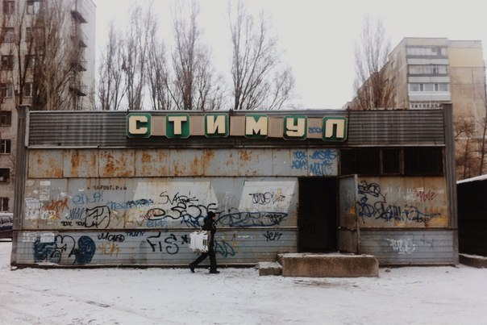

# Книжки - моё хобби. Я люблю их обе

Магазины “Стимул” - очень интересное социально-культурное явление
середины 80-х. Тогда советское правительство почему-то озаботилось
проблемой утилизации вторсырья (подозреваю, что кто-то могущественный
съездил заграницу, увидел там и сказал, что “нам тоже надо“, поскольку
объективных предпосылок для этой затеи не было почти никаких).

Суть заключалась в следующем. Граждане приносят в специально устроенные
пункты сети “Стимул“ домашнее вторсырье (прежде всего макулатуру), а
взамен получают книги. Нормальных книг в свободной продаже не было
почти никаких, поэтому народ воспринял идею на ура. Очереди у этих
“Стимулов”, представляющих собой вот аккурат такие сарайки, как на фото
(подозреваю даже, что это та самая, где довелось побывать мне),
выстраивались астрономические. Причем сами книги выдавали не здесь.
Здесь получали талон, с которым шли в специальный книжный магазин и уже
там “отоваривались”. Старой бумаги надо было сдать за одну книгу
немало, килограмм 50.

А теперь самое интересное: что за книги удавалось в итоге раздобыть.
Детективы Сименона, “Княжна Тараканова“ Данилевского… Не в обиду этим
авторам будет сказано, не самые известные произведения не самых
известных писателей. В стране, где мало кто имел возможность прочитать
Дюма, Майн Рида, Дефо, Стивенсона (в библиотеках на их книги нужно было
записываться в многонедельную очередь), где невозможно было раздобыть
хорошие пособия по истории и искусству, да и произведения классиков
отечественной литературы появлялись в продаже весьма эпизодически,
народу предлагались книги, для прочтения которых нужен некий базовый
культурный уровень (например, неподготовленный читатель вряд ли
сориентируется в обстановке, в которой разворачиваются события той же
“Княжны Таракановой“).

Выбора в “Стимулах“ не было: если сказано, что “дают Сименона“, значит
несколько недель подряд будут “давать” только Сименона. И вот
выясняется, что в полумиллионном провинциальном городе у этого писателя
поклонников больше, чем во всей Франции. Ради счастья обладать
сборником его детективов граждане готовы с раннего утра тащить
50-килограммовые котомки, выстаивать многочасовые очереди и, получив
заветный талончик, ехать на другой конец города в особый книжный
магазин (припоминаю, кстати, что талон не покрывал цену книги, а лишь
давал право на ее приобретение, т.е. нужно было еще и платить почти
столько же, как если бы книга была в свободной продаже).

И вот в руках действительно добротно изданный, модный том. Но открыв
его и прочитав несколько страниц большинство решает вернуться к
освоению творчества Сименона “как нибудь на досуге“, и… с чувством
глубокого удовлетворения книголюб (бытовало тогда такое слово, наравне
со словом читатель) ставит красивую книгу на самое видное место в
купленной месяц назад по блату румынской стенке.
