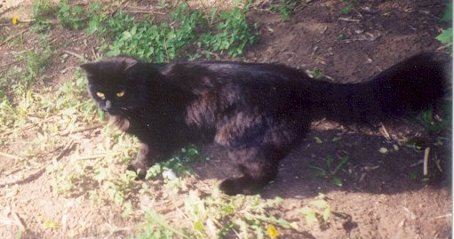

# История кота Зухеля

С детства я был приучен к мысли, что держать дома животных (тех, что
американцы обозначают понятием pets) - это не для нас. Это, мол,
ответственность, расходы и т.п. Я охотно придерживался этого мнения до
2002 года, одного из самых сложных в моей жизни.

В 2001 году умер мой отец. Устав от многомесячного стресса, связанного
с известными процессами, неизменно следующими за похоронами, и получив
свою долю наследства, я решил уволиться с работы и просто спокойно
пожить, отдавая время прочно уже полюбившемуся к тому времени
программированию на языке Java и попыткам основать “свой собственный
бизнес”. Последнее, как я теперь понимаю, было явным самообманом.
Просто нужно же что-то было отвечать на вопрос: “Где ты сейчас
работаешь?” Ведь не скажешь: “Сижу дома, мысленно посылаю в задницу
всех своих прежних работодателей и наслаждаюсь тем обстоятельством, что
никуда не надо торопиться по утрам”.

Тем не менее, ООО было зарегистрировано. Я разрабатывал ПО для
бизнес-справочника, который намеревался продавать, арендовал офис и уже
нашел первых клиентов, но наступило лето, деловая активность упала, и
дело замерло. Впрочем, главной причиной пробуксовки стало, конечно же,
то, что справочник мой был сыроват и требовал доработки. Он был написан
под IE 6.0 (напомню, дело было в 2001-2002 гг.), а я не ожидал, что так
много людей работает с другими браузерами.

Денег на то, чтобы протянуть еще несколько месяцев и довести проект до
логического конца, у меня могло бы хватить, но я решил купить две
комнаты в коммуналке на окраине города. Своего жилья у меня не было, а
за съем квартиры (да и офиса) приходилось платить не то чтобы слишком
дорого, но мириться с тем, что батино наследство утекает в чужие
карманы я не хотел.

Однажды непыльным майским днем 2002 г. я сидел в “офисе” (небольшом
помещении под лестницей, которое по случаю за 200 долларов выкупил у
знакомого предпринимателя) и пытался дописать свой электронный
справочник. В коридоре отчаянно орал котенок, причем орал уже несколько
часов почти без перерыва. В конце концов я попросил офис-менеджера Вику
выяснить что там за дела. Она выполнила просьбу довольно неожиданным
образом: притащила в офис непосредственного нарушителя спокойствия,
коим оказался черный зверек, очень маленький, но уже довольно резво
передвигавшийся самостоятельно.

Мгновенно успокоившись и деловито обойдя офис по периметру, существо
деловито запрыгнуло мне на колени, свернулось клубочком и уснуло. Я был
не в восторге, но отказывать измученному котенку в удовольствии поспать
спокойно не стал. Видимо, его подкинули в наш “офисятник”. Вика
сказала, что в коридоре для сиротинушки кто-то из соседских теток уже
устроил коробочку с подстилкой, поставил мисочку и т.п. Я решил, что в
конце дня верну его “на историческую родину”, а пока пусть себе поспит.
Оно вроде как и приятно, когда котенок на коленях.

В конце рабочего дня я попросил Вику вернуть гостя восвояси, но тот
устроил форменную истерику, а девушка, почувствовав неладное,
быстренько смоталась домой, предварительно поведав, что у нее аллергия
на шерсть. Я тоже стал подозревать неладное, а именно, что котег
напрашивается в гости. Тем не менее, решил выждать часок, а потом еще
раз попробовать уговорить его вернуться в коробку. Пока я играл в
Xenix, зверь внимательно следил за перемещающимися по экрану шариками
(позднее я узнал, что только котятам интересно следить за движущимися
изображениями на экранах мониторов и телевизоров, взрослые коты эту
способность утрачивают). Часов в 7 вечера я стал собираться домой. В
коробку котярик возвращаться отказался в истерическо-категорической
форме, и ничего не оставалось, как засунуть его за пазуху плаща и
двинуть на автобусную остановку.

За пазухой все 40 минут, пока добирались на мою окраину, творилось
форменное светопреставление: кот орал, царапался, пытался выпрыгнуть,
но когда ему предлагалось проваливать к чертовой бабушке на все четыре
стороны, моментально утихал и некоторое время вел себя смирно. Впрочем,
десантировать его я бы, конечно, и не решился: погода была холодная, и
это был бы для него гораздо менее способствующим выживанию вариантом,
чем коробка в коридоре “офисятника”.

Итак, в автобусе из-за пазухи у меня торчала черная морда, время от
времени сотрясающая воздух драматическими воплями, умиляя тем самым
бабушек-попутчиц. Уже не помню, чем я в первый вечер накормил своего
питомца по приезде домой (а то, что он будет жить у меня, уже сомнению
не подлежало), но после того, как я лег спать, он запрыгнул ко мне на
подушку и свернулся клубочком. Утром я нашел его в точно такой же позе,
в которой видел последний раз засыпая. Видимо котег так извелся от
стресса, что спал мертвецким сном все эти 8 часов.

По поводу того, как назвать котенка, у меня не было ни малейших
сомнений: Зухель. В то время был популярен программистский анекдот:
“Сидят два прогера, один спрашивает: ‘Ты почему кота Зухелем назвал?’ -
‘А вот смотри. Зухель, коннект! (наступает коту на хвост)’. Зухель:
‘Пшшшшшшшшшшшш’”. Я, впрочем, к такому садизму не склонен, но имя
понравилось.

В том, что в моей жизни появилось такое вот существо были несомненные
плюсы. В разводе я был на тот момент уже несколько лет, в условиях
надвигавшегося финансового коллапса и крушения “бизнеса” о нормальном
устройстве личной жизни не приходилось и мечтать (а “ненормального
устройства” я уже на тот момент наелся досыта). Одиночество - не самое
любимое мое состояние, так что у нас с Зухелем сложились самые что ни
наесть задушевные отношения. Фирму я вскоре закрыл и стал потихоньку
проживать остатки денег, а потом и вовсе жить непонятно на что. За
компьютером я проводил в ту пору часов по 20 на протяжении нескольких
месяцев, а посему плохо помню материальные обстоятельства.

Впрочем, рассказ о коте. Очень скоро выяснилось, что его нужно кормить.
Тут в рассказ нужно ввести еще одного персонажа. Как я уже упомянул,
комнаты мои были частью коммунальной квартиры, соседом по которой
оказался дядя Гера - самый обыкновенный отечественный пенсионер. Он всю
жизнь проработал простым слесарем на заводе, иногда выпивал и слегка
буянил, но именно он поддержал меня в эти непростые месяцы. И добрым
словом, а иной раз и тарелку супа наливал, что греха таить.

Для дяди Геры, в отличие от меня, кот в квартире был не в новинку. В
том районе, где находится наш дом, нравы почти деревенские. Жители
обветшавших малоэтажных бараков послевоенной постройки почти поголовно
держат кошек и собак, а неподалеку и вовсе частный сектор - татарский
поселок, именуемый в просторечии Шанхай. По поводу кормежки кота дядя
Гера считал, что лучший вариант - сырая рыба. Я придерживался другого
мнения и покупал сухой корм. Однако, поскольку днем я отлучался (время
от времени находил заработки), сосед явочным порядком кормил Зухеля
рыбой путасу, от чего деревянный пол нашей холостяцкой кухни напоминал
плохоотмываемую палубу рыболовецкого траулера: весь в рыбьих кишках,
чешуе и т.п. Это продолжалось до тех пор, пока я не догадался
выдаваемую Зухелю рыбину прицеплять за глаз проволочным крюком к
батарее. В результате площадь “палубы” резко сократилась и проблема
кормежки была решена.

Зухель подрастал, и проблем с ним, в общем-то не было. Первая возникла,
когда я упустил момент смены его “детской” шерсти на “взрослую”. Мех у
него был довольно длинный, и во время первой линьки выпавший подпушек
перемешался с новой шерстью. В результате один из боков кота
превратился в самый натуральный валенок. Я потом несколько недель где
расчесывал, где раздергивал эти комки, а в самых одиозных местах просто
вырезал ножницами. Зухель еще долго потом ходил с чуть ли не лысым
боком.

Самая главная проблема с кошками (и это подтвердит, думаю, любой
котовладелец) - их стремление на улицу. Проблема скорее
психологическая. Кошка (кот) может жить и в помещении безвылазно, но
жалко ведь смотреть на то, как они непрестанно ищут способ вырваться на
свободу. В моем случае это скрашивалось тем, что комнаты мои находились
на первом этаже. Под ними прежними владельцами был выкопан подвал с
кошачим лазом, но я его, пока котик не подрос, держал закрытым. Тем не
менее, Зухель, сидя на подоконнике, играл в гляделки с дворовыми
собратьями и я понимал, что рано или поздно выпускать придется.

Первый “выход в свет” состоялся где-то в середине осени, когда кот стал
рваться на улицу не на шутку и впал в депрессию по поводу своего
“заточения”. Как сейчас помню, выпал первый снег в тот день, когда я
открыл в подвале лаз на улицу. Зухель уже давно протоптал к нему
тропинку изнутри. Впервые оказавшись на воле, он стал потихоньку
красться по снегу. Черный кот крадется по белому снегу. Это было так
трогательно…

Поначалу Зухель гулял под моим присмотром (я наблюдал через окно за его
первыми шагами в большой кошачий мир). В одну из первых вылазок под
окнами его ждал взрослый кот, с которым они давно общались через
стекло. Увидев старого знакомого, юный энтузиаст радостно и наивно
выскочил навстречу “другу”. Бывалый сородич, конечно же, навалял ему по
первое число, после чего Зухель, видимо, впервые задумался о том, что
во дворе всё не так просто, как выглядит из окна комнаты. Это, впрочем,
не остановило его, и очень скоро он принес домой новую беду - блох.

В принципе, блохи у кошки, которой разрешается гулять во дворе - это
неизбежность. Но наш герой то ли не имел к ним по первости иммунитета,
то ли не умел с ними эффективно бороться, и замучили они его зверски. У
кота пропал аппетит, он даже в голос жаловался на свою беду. На
счастье, у меня был шампунь, только не от блох, а от вшей. Тут нужно
оговориться, что я, хоть и вел явно маргинальный образ жизни, до
педикулеза, слава богу, не докатился. Немного вышеупомянутого шампуня
досталось от прежних владельцев офиса, в котором располагалась
вышеупомянуиая фирма. Говорят, какая-то девушка из прежде там
работавших, действительно где-то подцепила педикулез. Как человек
ответственный, она не стала скрывать это обстоятельство и принесла в
офис шампунь на случай, если кто-то успел заразиться от нее. Снадобье,
к счастью, никому не пригодилось, а я, когда “сматывал удочки”,
прихватил бутылек вместе с прочим хламом из кладовки.

Вот этим-то шампунем я и вымыл страдающего от насекомых Зухелька. Он,
конечно, сопротивлялся по страшной силе и орал в тазике на все два
этажа и два подъезда нашего барачного строения. Вообще-то этот кот
обладал редким для своего биологического вида качеством: отсутствием
водобоязни. Когда его как-то раз взяли на пляж, он зашел в воду и стал
бродить по мелководью, рассматривая в воде мальков. В тазике же -
другое дело. То ли отвратительный запах антившивого шампуня
подействовал, то ли ограниченное пространство, но руки он мне исцарапал
по-взрослому. Самое же страшное произошло потом, когда я взял кусок
старой простыни, вытер ею страдальца, расстелил эту тряпку под батареей
и посадил на нее кота сушиться. Господи, как они из него поперли!
Никогда не забуду эти мирриады расползающихся черных точек на белом
фоне… Впоследствии блохи у Зухеля, конечно же, были, но в допустимых
количествах, не мешающих жить большинству его сородичей.

Со временем я перестал контролировать все аспекты пребывания кота на
улице. Он стал уходить и приходить когда вздумается. Очень, знаете ли,
романтично просыпаться утром от того, что котик, погуляв всю точь под
дождем, с разбегу запрыгивает к вам в постель для выражения дружеских
чувств. Впрочем, следы от грязных лап на простынях и наволочках -
ничтожная платиа за эту искреннюю кошачью привязанность и
благодарность.

Да, вот какой еще был случай. Как-то раз, в пору, когда котенок гулял
еще под моим присмотром, я вывел его на улицу, вечером когда уже
смеркалось. Зухель отбежал метров 20 в сторону свалки, что мне не
понравилось и, несколько раз окликнув его по-хорошему, я перешел на
“русский устный”, обратившись к коту примерно с такой речью: “Ну ты, б…
такая, долго еще по помойкам будешь шароё…ся?! А ну марш домой!” В этот
момент я увидел, что у соседнего подъезда стоит в нерешительности
женщина. То ли пришла к кому-то, да адрес точно не знает, то ли просто
заплутала. Почему-то она эти слова приняла на свой счет и, густо
покраснев, быстро скрылась в направлении автобусной остановки.

Что и говорить, я очень привязался к коту. Особенно это почувствовалось
в последние осенние дни перед заморозками, когда проливные дожди шли
пару недель подряд. В один из таких дней Зухель ушел из дома и не
вернулся. Я выходил его искать, звал, но без толку. Не вернулся он и
через день, и через два. Наклевывалась вероятность худшего исхода
событий. А худший исход событий для кошки на Нижнем поселке - это не
просто перспектива быть разорванным бродячими собаками или попасть под
колеса автомобиля. Дядя Гера говорил, что кошек не раз отлавливали
бомжи для употребления в пищу и ради меха. Впрочем, случаев когда,
кошки находились спустя месяцы и даже годы тоже предостаточно, так что
совсем уж отчаиваться я не стал. И вот в одну дождливую ночь, когда
кроме моих окон на улице не светилось ничего до самого Среднего
поселка, из промозглой тьмы раздалось отчаянное “Мяу!” (уже не помню,
по какой причине был закрыт лаз в подвал). Бросаюсь на улицу, нащупываю
в мокрых кустах своего промокшего насквозь, всего в листьях и песке
питомца, тащу домой, сразу в душ, мою теплой водой… Господи, да у него
же одного глаза нет! Вместо глаза какое-то кровавое месиво. Да, неплохо
котик погулял. Но, с другой стороны, видать не последняя личность во
дворе, раз в таких нешуточных драках участвует.

А глаз-то, между прочим, восстановился. Конечно, ткани вокруг него
изрядно пострадали, но само яблоко просто ушло внутрь черепной коробки
и впоследствии заняло свое место на морде. Раны затянулись и следов
побоища не осталось ровным счетом никаких. Вот что значит “заживает как
на кошке”.

Всю зиму Зухель, как и большинство его коллег, просидел дома. Весной же
вновь стал гулять, и тут мое соприкосновение с миром кошачьих перешло в
новую неожиданную стадию. Как-то раз просыпаюсь я утром в хорошем
настроении. Сквозь остатки сна чувствую, что погода на улице хорошая,
дома тепло, котик по комнате ходит… Открываю глаза: батюшки, да это не
мой котик! И вообще похоже, что это кошечка! Откуда такие гости? Выхожу
из спальни в большую комнату, а там целое заседание государственной
думы: штук пять кошаков. Кто блаженно разлегся на диване, кто степенно
прогуливается. Я их, конечно, разогнал, но такие коллективные визиты
стали регулярными.

Зухель, оказывается, не только завоевал во дворе авторитет, но и стал
душой компании. Как-то раз я застал его за тем, что он угощал из своей
миски какого-то уж очень исхудавшего родственника. Однако в большинстве
случаев в моей большой комнате по ночам происходили выяснения отношений
с воплями, беготней и прочими никак не укрепляющими сон моментами.
Причем бесила безнаказанность таких сходок: как только я вставал с
кровати, все ускользали в кошачий лаз и через подвал преспокойно
эвакуировались.

У меня тоже есть территориальный инстинкт, так что пару раз мне
удавалось изловчиться и проучить шваброй зазевавшихся мерзавцев, и
все-таки, в большинстве случаев им удавалось уходить безнаказанными. Не
учли коты лишь того, что я - человек, царь природы, в моей власти
интеллект и высокие технологии.

Однажды я положил на пол в большой комнате длинный обрезок
пресс-картона. Один его конец был у кошачьего лаза, другой - у двери в
спальню. Если я ночью просыпался от подозрительных шорохов в большой
комнате, то потихоньку вставал и резко задвигал этой заслонкой лаз, не
входя в комнату. Дальше оставалось только неторопясь включить свет,
сходить в санузел за шваброй и маленько поучить охреневшего посетителя.
Некоторые, правда, уворачиваясь, роняли люстру и занавески, зато больше
уж никогда не появлялись у нас.

Зухель, наверно, очень морально страдал от таких карательных мер. Думаю
даже, что на какое-то время его авторитет в кошачьем мире был
основательно подмочен и репутация рубахи-парня сменилась ярлыком,
соответствующим в мире людей чему-нибудь вроде Павлика Морозова или
Ивана Сусанина. Как бы то ни было, всех ночных гостей я потихоньку
отвадил. Нехорошо получилось, правда, с соседским Рыжиком. Когда слухи
о моих жестких военных операциях через дядю Геру просочились во двор,
хозяйка этого кота пришла ко мне с разборками, мол я его загубил, Рыжик
уже несколько дней не появляется дома. Вскоре выяснилось, что он просто
загулял, так как через несколько дней я с огромным облегчением увидел
его на подоконнике соседской кухни.

Что еще рассказать о Зухеле? Повзрослев, он с успехом ловил крыс (они
на нашей окраине не редкость). Как-то раз притащил в дом живого
воробья, которого я еле спас из его лап. Удивлял нас с дядей Герой
способностью встречать у автобуса по вечерам (я таки устроился к тому
времени на работу). Потом оказалось, что кот высматривает нас с вершины
самого высокого дерева - огромного, едва ли не столетнего ясеня,
росшего под нашими окнами (сейчас, говорят, спилили его).

К сожалению, на вторую осень Зухель бесследно пропал. Не знаю что
случилось, только однажды он не вернулся домой ни через день, ни через
два, ни через месяц… Спасибо тебе, кот, за то, что поддержал меня в
самые отчаянные месяцы моей жизни. И прости меня, если чем обидел.

Написано в 2008г. Небольшие небольшие правки внесены в 2017 г.
